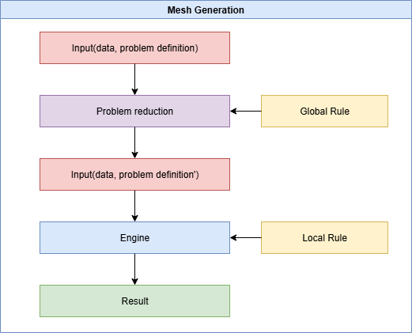

# 框架

详细解释：

1. Input(data, problem definition):
    1. data：指输入的数据，要处理的初始数据
    2. problem definition：对问题的定义，所有的mesh generation算法中都需要遵守的规定，生成n边形的网格，初始数据是m维的数据等
2. Global Rule:
    
    所有Mesh Generation问题都适用的规则，包括所有的几何拓扑规则
    
3. Problem reduction:
    
    通过input中的problem definition与global rule，尝试将原始的问题map到一个已经被解决或者被简化的问题，同时也需要判断problem definition是否与global rule冲突，形成一个无解的问题。
    
4. Input(data, problem definition’):
    1. data：依旧是初始的原始输入数据
    2. problem definition’：经过reduction之后的问题定义
5. Local Rule：
    
    根据算法定制的规则，并非所有的mesh generation算法都需要遵守，而是算法特殊的规则，启发式规则等
    
6. Engine：
    
    通过data，problem definition’，global rule，local rule作为input，拥有objective与method
    
    1. objective：engine的目的，直到达到objective之前都会一直使用method
    2. method：解题的方法，或者说是为了完成objective的方法，这个过程中会遵守global rule与local rule

[从早期到现代的主流网格生成算法综述](%E4%BB%8E%E6%97%A9%E6%9C%9F%E5%88%B0%E7%8E%B0%E4%BB%A3%E7%9A%84%E4%B8%BB%E6%B5%81%E7%BD%91%E6%A0%BC%E7%94%9F%E6%88%90%E7%AE%97%E6%B3%95%E7%BB%BC%E8%BF%B0%202a951265fb45803ab852f84c45791aaa.md)

[目标贡献](%E7%9B%AE%E6%A0%87%E8%B4%A1%E7%8C%AE%202aa51265fb4580b697eae94aa89ae4eb.md)

[文章整体结构](%E6%96%87%E7%AB%A0%E6%95%B4%E4%BD%93%E7%BB%93%E6%9E%84%202aa51265fb4580c49538d5db54748fcd.md)