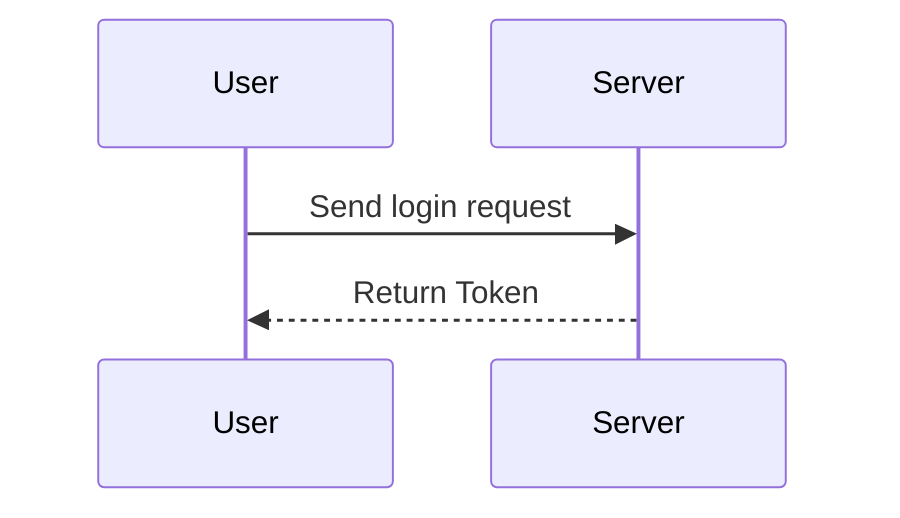

# API Documentation Guidelines

## I. Document Basic Structure Rules
Each API document corresponds to a `.md` file, with content organized in the following order:

### 1. Document Title and Metadata

```markdown
# API Name

> **Status**: `Official` | `Testing` | `Deprecated`  
> **Version**: v1.0.0  
> **Maintainer**: @JohnDoe  
> **Last Updated**: 2023-10-01
```

### 2. Table of Contents (Auto-generated or Manually Maintained)

```markdown
## Table of Contents
- [Overview](#overview)
- [Request Endpoint](#request-endpoint)
- [Request Parameters](#request-parameters)
- [Response Examples](#response-examples)
- [Error Codes](#error-codes)
- [Appendix](#appendix)
```

## II. Content Writing Standards

### 1. Overview (`## Overview`)
* Describe the core functionality of the API in 1-3 sentences.
* Optionally add a flowchart or architecture diagram (using Mermaid syntax or image links).

```markdown
## Overview
This API is used for user authentication, supporting phone numbers, email, and third-party login methods.
```

### 2. Request Endpoint (`## Request Endpoint`)
* Clearly specify the HTTP method, URL, and content type.
* Use code blocks to indicate the request format.

```markdown
## Request Endpoint
```http
POST /api/v1/auth/login
Content-Type: application/json
```
```

### 3. Request Parameters (`## Request Parameters`)
* Describe **path parameters**, **query parameters**, and **body parameters** separately.
* List fields in tables, mark **required** fields in bold or with emoji.

```markdown
## Request Parameters

### Path Parameters
| Parameter | Type   | Description   |
|-----------|--------|---------------|
| `user_id` | string | Unique user ID|

### Body Parameters
```json
{
  "username": "***Required***",
  "password": "***Required***",
  "remember_me": true
}
```

| Parameter | Type | Required | Default | Description |
|-----------|------|----------|---------|-------------|
| **username** | string | Yes | - | Login account |
| **password** | string | Yes | - | Password (at least 8 characters) |
| remember_me | boolean | No | false | Whether to keep login status |
```

### 4. Response Examples (`## Response Examples`)
* Clearly define success and failure response structures, with status codes.
* Use code blocks + comments to explain fields.

```markdown
## Response Examples

### Success Response (200 OK)
```json
{
  "code": 0,
  "data": {
    "user_id": "U_123456",
    "token": "xxxxx"
  },
  "message": "Login successful"
}
```

### Failure Response (400 Bad Request)
```json
{
  "code": 1001,
  "error": "INVALID_PASSWORD",
  "message": "Invalid password"
}
```
```

### 5. Error Codes (`## Error Codes`)
* List all possible error codes in table format.

```markdown
## Error Codes
| Error Code | HTTP Status Code | Description       |
|------------|------------------|-------------------|
| 1001       | 400              | Invalid password  |
| 1002       | 401              | Unauthorized access |
| 1003       | 404              | User not found    |
```

### 6. Appendix (`## Appendix`)
* Optionally add notes, version change logs, etc.

```markdown
## Appendix
### Notes
1. Password must be transmitted encrypted (SHA-256).
2. Test environment address: `https://test-api.example.com`

### Version History
- v1.0.0 (2023-10-01): Initial version
```

## III. Markdown Style Enhancement Techniques

### 1. Web Display Adaptation
* **Code Highlighting**: Use code blocks with language identifiers (such as `json`, `http`).
* **Collapsible Content**: Use `<details>` tags to hide non-essential information (supported by some renderers).

```markdown
<details>
<summary>Click to view detailed configuration</summary>

```json
{ "key": "value" }
```
</details>
```

### 2. Visual Enhancement
* **Important Notices**: Use emoji or colored labels (requires CSS support).

```markdown
> 🚨 **Warning**: This API is rate-limited to 10 requests per second!
```

* **Flowcharts**: Use Mermaid syntax (renderer support required).

```markdown

```

## IV. Unified Template Example

```markdown
# User Login API

> **Status**: `Official`  
> **Version**: v1.0.0  
> **Maintainer**: @JohnDoe  

## Table of Contents
- [Overview](#overview)
- [Request Endpoint](#request-endpoint)
- [Request Parameters](#request-parameters)
- [Response Examples](#response-examples)
- [Error Codes](#error-codes)

## Overview
User authentication interface, supporting multiple login methods...

## Request Endpoint
```http
POST /api/v1/auth/login
Content-Type: application/json
```

## Request Parameters
| Parameter | Type | Required | Description |
|-----------|------|----------|-------------|
| **username** | string | Yes | Login account |

## Response Examples
```json
{ "code": 0, "data": {} }
```

## Error Codes
| Error Code | HTTP Status Code | Description |
|------------|------------------|-------------|
| 1001 | 400 | Invalid password |
```

---

## V. Tool Chain Recommendations
1. **Validation Tool**: Use [markdownlint](https://github.com/DavidAnson/markdownlint) to check syntax compliance.
2. **Preview Tool**: VS Code + Markdown All in One plugin.
3. **Publishing Tool**: Generate HTML through `docsify` mentioned earlier or custom scripts.

By following these guidelines, you can ensure all API documentation is stylistically uniform, content-complete, and seamlessly adaptable for web display.