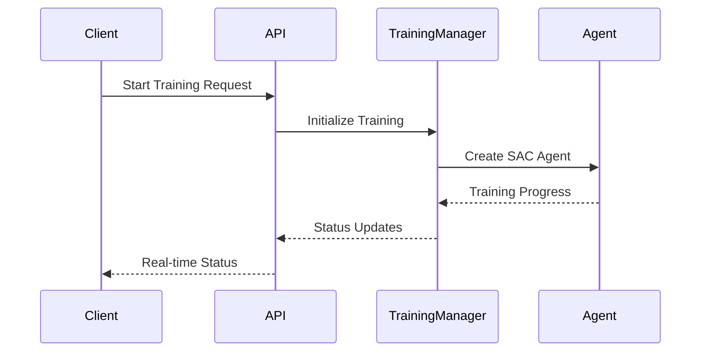

# Mesh Generation Training API Documentation

> **Status**: `Official`  
> **Version**: v1.0.0  
> **Maintainer**: @ZhuoQiuMcgill  
> **Last Updated**: 2025-01-10

## Table of Contents

- [Overview](#overview)
- [Base URL](#base-url)
- [Training Management APIs](#training-management-apis)
    - [Start Training](#start-training)
    - [Stop Training](#stop-training)
    - [Get Training Status](#get-training-status)
    - [Training Health Check](#training-health-check)
- [Mesh Management APIs](#mesh-management-apis)
    - [List Available Meshes](#list-available-meshes)
    - [Get Mesh Information](#get-mesh-information)
    - [Mesh Health Check](#mesh-health-check)
- [Error Codes](#error-codes)
- [Appendix](#appendix)

## Overview

This API provides endpoints for managing reinforcement learning-based mesh generation training sessions. It supports
starting/stopping training, monitoring training status, and managing mesh data files. The system uses SAC (Soft
Actor-Critic) algorithm for training intelligent agents to generate high-quality meshes.



## Base URL

```
http://127.0.0.1:5000
```

---

## Training Management APIs

### Start Training

Initiates a new training session with specified parameters.

#### Request Endpoint

```http
POST /training/start
Content-Type: application/json
```

#### Request Parameters

##### Body Parameters

```json
{
  "mesh_name": "simple_square",
  "subfolder": "mesh",
  "max_episodes": 1000,
  "max_steps": 1000
}
```

| Parameter    | Type    | Required | Default | Description                                           |
|--------------|---------|----------|---------|-------------------------------------------------------|
| mesh_name    | string  | No       | null    | Name of the mesh file to use (without .txt extension) |
| subfolder    | string  | No       | "mesh"  | Subfolder containing the mesh file                    |
| max_episodes | integer | No       | null    | Maximum number of training episodes                   |
| max_steps    | integer | No       | null    | Maximum steps per episode                             |

#### Response Examples

##### Success Response (200 OK)

```json
{
  "message": "training_started",
  "success": true,
  "config": {
    "mesh_name": "simple_square",
    "subfolder": "mesh",
    "max_episodes": 1000,
    "max_steps": 1000
  }
}
```

##### Failure Response (400 Bad Request)

```json
{
  "error": "Training already running",
  "success": false
}
```

---

### Stop Training

Stops the currently running training session.

#### Request Endpoint

```http
POST /training/stop
Content-Type: application/json
```

#### Request Parameters

No parameters required.

#### Response Examples

##### Success Response (200 OK)

```json
{
  "message": "stop_requested",
  "success": true
}
```

##### Failure Response (500 Internal Server Error)

```json
{
  "error": "Failed to stop training: Connection error",
  "success": false
}
```

---

### Get Training Status

Retrieves the current training status and statistics.

#### Request Endpoint

```http
GET /training/status
```

#### Request Parameters

No parameters required.

#### Response Examples

##### Success Response (200 OK)

```json
{
  "running": true,
  "status": "running",
  "stats": {
    "episode": 150,
    "total_steps": 15000,
    "episode_reward": 0.842,
    "average_reward": 0.756,
    "episode_length": 98,
    "boundary_vertices": 12,
    "buffer_size": 5000,
    "mesh_data": {
      "[0.0,0.0]": [
        [
          1.0,
          0.0
        ],
        [
          0.0,
          1.0
        ]
      ],
      "[1.0,0.0]": [
        [
          2.0,
          0.0
        ],
        [
          1.0,
          1.0
        ]
      ]
    },
    "boundary_vertices_data": [
      [
        0.0,
        0.0
      ],
      [
        2.0,
        0.0
      ],
      [
        2.0,
        2.0
      ],
      [
        0.0,
        2.0
      ]
    ],
    "reference_point_info": {
      "ref_vertex": [
        1.0,
        1.0
      ],
      "local_env_vertices": [
        [
          0.0,
          1.0
        ],
        [
          1.0,
          1.0
        ],
        [
          2.0,
          1.0
        ]
      ]
    }
  },
  "progress": {
    "current_episode": 150,
    "total_steps": 15000,
    "latest_reward": 0.842,
    "average_reward": 0.756,
    "buffer_utilization": 5000
  },
  "timestamp": 1641888000.123
}
```

##### Training Not Running (200 OK)

```json
{
  "running": false,
  "status": "idle",
  "stats": null,
  "timestamp": 1641888000.123
}
```

---

### Training Health Check

Checks the health status of the training service.

#### Request Endpoint

```http
GET /training/health
```

#### Response Examples

##### Success Response (200 OK)

```json
{
  "status": "healthy",
  "service": "training-api",
  "manager_running": false,
  "timestamp": 1641888000.123
}
```

---

## Mesh Management APIs

### List Available Meshes

Retrieves a list of available mesh files from the specified subfolder.

#### Request Endpoint

```http
GET /mesh/list
```

#### Request Parameters

##### Query Parameters

| Parameter | Type   | Required | Default | Description                        |
|-----------|--------|----------|---------|------------------------------------|
| subfolder | string | No       | "mesh"  | Subfolder to search for mesh files |

#### Response Examples

##### Success Response (200 OK)

```json
{
  "meshes": [
    "simple_square",
    "triangle",
    "rectangle",
    "pentagon",
    "hexagon"
  ],
  "count": 5
}
```

##### Failure Response (500 Internal Server Error)

```json
{
  "error": "Failed to load mesh list: Directory not found",
  "meshes": [],
  "count": 0
}
```

---

### Get Mesh Information

Retrieves detailed information about a specific mesh file.

#### Request Endpoint

```http
GET /mesh/info/{mesh_name}
```

#### Request Parameters

##### Path Parameters

| Parameter     | Type   | Description                                    |
|---------------|--------|------------------------------------------------|
| **mesh_name** | string | Name of the mesh file (without .txt extension) |

##### Query Parameters

| Parameter | Type   | Required | Default | Description                        |
|-----------|--------|----------|---------|------------------------------------|
| subfolder | string | No       | "mesh"  | Subfolder containing the mesh file |

#### Response Examples

##### Success Response (200 OK)

```json
{
  "name": "simple_square",
  "subfolder": "mesh",
  "exists": true,
  "vertex_count": 4,
  "file_size": 128,
  "error": null
}
```

##### File Not Found (200 OK)

```json
{
  "name": "nonexistent_mesh",
  "subfolder": "mesh",
  "exists": false,
  "vertex_count": 0,
  "file_size": 0,
  "error": "File does not exist"
}
```

---

### Mesh Health Check

Checks the health status of the mesh management service.

#### Request Endpoint

```http
GET /mesh/health
```

#### Response Examples

##### Success Response (200 OK)

```json
{
  "status": "healthy",
  "service": "mesh-api",
  "timestamp": 1641888000.123
}
```

---

## Error Codes

| Error Code | HTTP Status Code          | Description                                            |
|------------|---------------------------|--------------------------------------------------------|
| 400        | 400 Bad Request           | Invalid request parameters or training already running |
| 404        | 404 Not Found             | Requested resource not found                           |
| 500        | 500 Internal Server Error | Server-side error during processing                    |

### Common Error Response Format

```json
{
  "error": "Error description",
  "success": false
}
```

---

## Appendix

### Notes

1. **CORS Support**: The API supports Cross-Origin Resource Sharing (CORS) for frontend integration.
2. **Real-time Updates**: Training status should be polled periodically (recommended: every 10 seconds) for real-time
   monitoring.
3. **Mesh File Format**: Mesh files should be in `.txt` format with coordinates specified as `x y` pairs, one per line.
4. **Training Sessions**: Only one training session can run at a time. Attempting to start a new session while one is
   running will result in an error.

### Configuration

- **Default Port**: 5000
- **Default Host**: 0.0.0.0 (all interfaces)
- **Debug Mode**: Enabled in development

### Sample Mesh File Format

```txt
# Simple square mesh
0.000 0.000
2.000 0.000  
2.000 2.000
0.000 2.000
```

### Version History

- v1.0.0 (2025-01-10): Initial API version with training and mesh management endpoints

### Development Environment

- **Test API Base URL**: `http://localhost:5000`
- **Frontend Integration**: Web interface available via `tools/train.html`
- **Canvas Drawing Tool**: Interactive mesh creation available via `tools/canvas.html`