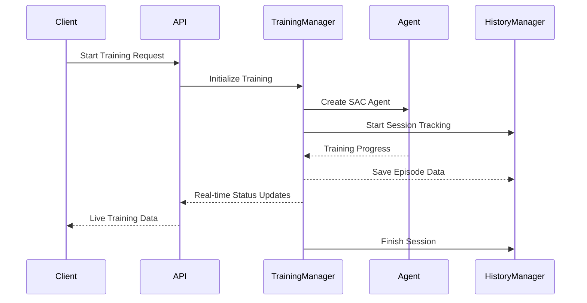

# Mesh Generation Training API Documentation

> **Status**: `Official`  
> **Version**: v1.2.0  
> **Maintainer**: @ZhuoQiuMcgill  
> **Last Updated**: 2025-01-10

## Table of Contents

- [Overview](#overview)
- [Base URL](#base-url)
- [Training Management APIs](#training-management-apis)
    - [Start Training](#start-training)
    - [Stop Training](#stop-training)
    - [Get Training Status](#get-training-status)
    - [Training Health Check](#training-health-check)
- [Mesh Management APIs](#mesh-management-apis)
    - [List Available Meshes](#list-available-meshes)
    - [Get Mesh Information](#get-mesh-information)
    - [Mesh Health Check](#mesh-health-check)
- [Training History APIs](#training-history-apis)
    - [List Training History](#list-training-history)
    - [Get Training Information](#get-training-information)
    - [Get Current Training Info](#get-current-training-info)
    - [Export Training Summary](#export-training-summary)
    - [Get Episode Data](#get-episode-data)
    - [Get Training Statistics](#get-training-statistics)
    - [Search Training History](#search-training-history)
    - [History Health Check](#history-health-check)
- [Error Codes](#error-codes)
- [Data Models](#data-models)
- [Appendix](#appendix)

## Overview

This API provides comprehensive endpoints for managing reinforcement learning-based mesh generation training sessions.
It supports SAC (Soft Actor-Critic) algorithm for training intelligent agents to generate high-quality meshes, with full
training history management and real-time monitoring capabilities.

The system now includes advanced features such as:

- **Training History Management**: Automatic tracking and storage of all training sessions
- **Real-time Mesh Visualization**: Live mesh and boundary data during training
- **Multiple Buffer Types**: Support for normal replay buffer, prioritized experience replay (PER), and online learning
  mode
- **Comprehensive Statistics**: Detailed episode-by-episode tracking with performance metrics



## Base URL

```
http://127.0.0.1:5000
```

---

## Training Management APIs

### Start Training

Initiates a new training session with specified parameters and automatic history tracking.

#### Request Endpoint

```http
POST /training/start
Content-Type: application/json
```

#### Request Parameters

##### Body Parameters

```json
{
  "mesh_name": "simple_square",
  "subfolder": "mesh",
  "max_episodes": 1000,
  "max_steps": 1000,
  "description": "Training on simple square mesh with SAC algorithm"
}
```

| Parameter    | Type    | Required | Default | Description                                           |
|--------------|---------|----------|---------|-------------------------------------------------------|
| mesh_name    | string  | No       | null    | Name of the mesh file to use (without .txt extension) |
| subfolder    | string  | No       | "mesh"  | Subfolder containing the mesh file                    |
| max_episodes | integer | No       | null    | Maximum number of training episodes                   |
| max_steps    | integer | No       | null    | Maximum steps per episode                             |
| description  | string  | No       | null    | Description for this training session                 |

#### Response Examples

##### Success Response (200 OK)

```json
{
  "message": "training_started",
  "success": true,
  "config": {
    "mesh_name": "simple_square",
    "subfolder": "mesh",
    "max_episodes": 1000,
    "max_steps": 1000,
    "description": "Training on simple square mesh with SAC algorithm"
  }
}
```

##### Failure Response (400 Bad Request)

```json
{
  "error": "Training already running",
  "success": false
}
```

---

### Stop Training

Stops the currently running training session and finalizes history tracking.

#### Request Endpoint

```http
POST /training/stop
Content-Type: application/json
```

#### Request Parameters

No parameters required.

#### Response Examples

##### Success Response (200 OK)

```json
{
  "message": "stop_requested",
  "success": true
}
```

##### Failure Response (500 Internal Server Error)

```json
{
  "error": "Failed to stop training: Connection error",
  "success": false
}
```

---

### Get Training Status

Retrieves comprehensive real-time training status including mesh visualization data.

#### Request Endpoint

```http
GET /training/status
```

#### Request Parameters

No parameters required.

#### Response Examples

##### Success Response (200 OK)

```json
{
  "running": true,
  "status": "running",
  "stats": {
    "episode": 150,
    "total_steps": 15000,
    "episode_reward": 0.842,
    "average_reward": 0.756,
    "episode_length": 98,
    "boundary_vertices": 12,
    "buffer_size": 5000,
    "training_id": "train_20250110_143022_simple_square",
    "online_learning_mode": false,
    "recent_actor_loss": 0.003421,
    "recent_critic_loss": 0.005123,
    "current_alpha": 0.2,
    "mesh_data": {
      "[0.0,0.0]": [
        [
          1.0,
          0.0
        ],
        [
          0.0,
          1.0
        ]
      ],
      "[1.0,0.0]": [
        [
          2.0,
          0.0
        ],
        [
          1.0,
          1.0
        ]
      ]
    },
    "boundary_vertices_data": [
      [
        0.0,
        0.0
      ],
      [
        2.0,
        0.0
      ],
      [
        2.0,
        2.0
      ],
      [
        0.0,
        2.0
      ]
    ],
    "reference_point_info": {
      "ref_vertex": [
        1.0,
        1.0
      ],
      "local_env_vertices": [
        [
          0.0,
          1.0
        ],
        [
          1.0,
          1.0
        ],
        [
          2.0,
          1.0
        ]
      ]
    }
  },
  "progress": {
    "current_episode": 150,
    "total_steps": 15000,
    "latest_reward": 0.842,
    "average_reward": 0.756,
    "buffer_utilization": 5000
  },
  "timestamp": 1641888000.123
}
```

##### Training Not Running (200 OK)

```json
{
  "running": false,
  "status": "idle",
  "stats": null,
  "timestamp": 1641888000.123
}
```

---

### Training Health Check

Checks the health status of the training service.

#### Request Endpoint

```http
GET /training/health
```

#### Response Examples

##### Success Response (200 OK)

```json
{
  "status": "healthy",
  "service": "training-api",
  "manager_running": false,
  "timestamp": 1641888000.123
}
```

---

## Mesh Management APIs

### List Available Meshes

Retrieves a list of available mesh files from the specified subfolder.

#### Request Endpoint

```http
GET /mesh/list
```

#### Request Parameters

##### Query Parameters

| Parameter | Type   | Required | Default | Description                        |
|-----------|--------|----------|---------|------------------------------------|
| subfolder | string | No       | "mesh"  | Subfolder to search for mesh files |

#### Response Examples

##### Success Response (200 OK)

```json
{
  "meshes": [
    "1",
    "2",
    "3",
    "4",
    "simple_square",
    "triangle",
    "rectangle",
    "pentagon",
    "hexagon"
  ],
  "count": 9
}
```

##### Failure Response (500 Internal Server Error)

```json
{
  "error": "Failed to load mesh list: Directory not found",
  "meshes": [],
  "count": 0
}
```

---

### Get Mesh Information

Retrieves detailed information about a specific mesh file.

#### Request Endpoint

```http
GET /mesh/info/{mesh_name}
```

#### Request Parameters

##### Path Parameters

| Parameter     | Type   | Description                                    |
|---------------|--------|------------------------------------------------|
| **mesh_name** | string | Name of the mesh file (without .txt extension) |

##### Query Parameters

| Parameter | Type   | Required | Default | Description                        |
|-----------|--------|----------|---------|------------------------------------|
| subfolder | string | No       | "mesh"  | Subfolder containing the mesh file |

#### Response Examples

##### Success Response (200 OK)

```json
{
  "name": "simple_square",
  "subfolder": "mesh",
  "configured_path": "/project/data/mesh",
  "file_path": "/project/data/mesh/simple_square.txt",
  "exists": true,
  "vertex_count": 4,
  "file_size": 128,
  "error": null
}
```

##### File Not Found (200 OK)

```json
{
  "name": "nonexistent_mesh",
  "subfolder": "mesh",
  "exists": false,
  "vertex_count": 0,
  "file_size": 0,
  "error": "File does not exist"
}
```

---

### Mesh Health Check

Checks the health status of the mesh management service.

#### Request Endpoint

```http
GET /mesh/health
```

#### Response Examples

##### Success Response (200 OK)

```json
{
  "status": "healthy",
  "service": "mesh-api",
  "timestamp": 1641888000.123
}
```

---

## Training History APIs

### List Training History

Retrieves a list of all training sessions with metadata.

#### Request Endpoint

```http
GET /training/history/list
```

#### Request Parameters

No parameters required.

#### Response Examples

##### Success Response (200 OK)

```json
{
  "success": true,
  "trainings": [
    {
      "training_id": "train_20250110_143022_simple_square",
      "metadata": {
        "mesh_name": "simple_square",
        "start_datetime": "2025-01-10T14:30:22",
        "end_datetime": "2025-01-10T15:45:30",
        "status": "completed",
        "episodes_completed": 1000,
        "total_steps": 50000,
        "best_reward": 0.923,
        "description": "Training on simple square mesh with SAC algorithm",
        "duration_seconds": 4508
      },
      "episode_count": 1000
    }
  ],
  "count": 1
}
```

---

### Get Training Information

Retrieves detailed information about a specific training session.

#### Request Endpoint

```http
GET /training/history/info/{training_id}
```

#### Request Parameters

##### Path Parameters

| Parameter       | Type   | Description         |
|-----------------|--------|---------------------|
| **training_id** | string | Training session ID |

#### Response Examples

##### Success Response (200 OK)

```json
{
  "success": true,
  "training_info": {
    "training_id": "train_20250110_143022_simple_square",
    "metadata": {
      "mesh_name": "simple_square",
      "start_datetime": "2025-01-10T14:30:22",
      "end_datetime": "2025-01-10T15:45:30",
      "status": "completed",
      "episodes_completed": 1000,
      "total_steps": 50000,
      "best_reward": 0.923,
      "description": "Training on simple square mesh with SAC algorithm",
      "duration_seconds": 4508,
      "config_overrides": {
        "max_episodes": 1000,
        "max_steps": 1000,
        "online_learning_mode": false,
        "batch_size": 256
      },
      "final_stats": {
        "episode_rewards": [
          0.1,
          0.2,
          0.3,
          0.923
        ],
        "training_time": 4508.3,
        "evaluation_rewards": [
          0.8,
          0.85,
          0.9
        ]
      }
    },
    "episode_count": 1000
  }
}
```

##### Not Found Response (404 Not Found)

```json
{
  "success": false,
  "error": "Training session not found"
}
```

---

### Get Current Training Info

Retrieves information about the currently active training session.

#### Request Endpoint

```http
GET /training/history/current
```

#### Response Examples

##### Success Response (200 OK)

```json
{
  "success": true,
  "current_training_id": "train_20250110_143022_simple_square",
  "training_info": {
    "training_id": "train_20250110_143022_simple_square",
    "metadata": {
      "mesh_name": "simple_square",
      "start_datetime": "2025-01-10T14:30:22",
      "status": "running",
      "episodes_completed": 150,
      "description": "Training on simple square mesh with SAC algorithm"
    },
    "episode_count": 150
  }
}
```

##### No Active Training (404 Not Found)

```json
{
  "success": false,
  "error": "No active training session"
}
```

---

### Export Training Summary

Exports a comprehensive training summary report.

#### Request Endpoint

```http
POST /training/history/export/{training_id}
Content-Type: application/json
```

#### Request Parameters

##### Path Parameters

| Parameter       | Type   | Description         |
|-----------------|--------|---------------------|
| **training_id** | string | Training session ID |

##### Body Parameters

```json
{
  "export_path": "/path/to/export/summary.json"
}
```

| Parameter   | Type   | Required | Description                        |
|-------------|--------|----------|------------------------------------|
| export_path | string | No       | Custom export file path (optional) |

#### Response Examples

##### Success Response (200 OK)

```json
{
  "success": true,
  "export_path": "/project/results/train_20250110_143022_simple_square_summary.json",
  "message": "Training summary exported to: /project/results/train_20250110_143022_simple_square_summary.json"
}
```

---

### Get Episode Data

Retrieves detailed data for a specific episode within a training session.

#### Request Endpoint

```http
GET /training/history/episode/{training_id}/{episode_num}
```

#### Request Parameters

##### Path Parameters

| Parameter       | Type    | Description         |
|-----------------|---------|---------------------|
| **training_id** | string  | Training session ID |
| **episode_num** | integer | Episode number      |

#### Response Examples

##### Success Response (200 OK)

```json
{
  "success": true,
  "episode_data": {
    "episode": 150,
    "episode_reward": 0.842,
    "episode_length": 98,
    "total_steps": 15000,
    "mesh_data": {
      "[0.0,0.0]": [
        [
          1.0,
          0.0
        ],
        [
          0.0,
          1.0
        ]
      ]
    },
    "boundary_vertices": [
      [
        0.0,
        0.0
      ],
      [
        2.0,
        0.0
      ],
      [
        2.0,
        2.0
      ],
      [
        0.0,
        2.0
      ]
    ],
    "timestamp": 1641888000.123,
    "reference_point_info": {
      "ref_vertex": [
        1.0,
        1.0
      ],
      "local_env_vertices": [
        [
          0.0,
          1.0
        ],
        [
          1.0,
          1.0
        ],
        [
          2.0,
          1.0
        ]
      ]
    }
  }
}
```

##### Episode Not Found (404 Not Found)

```json
{
  "success": false,
  "error": "Episode 150 not found in training train_20250110_143022_simple_square"
}
```

---

### Get Training Statistics

Retrieves statistical summary for a training session.

#### Request Endpoint

```http
GET /training/history/stats/{training_id}
```

#### Request Parameters

##### Path Parameters

| Parameter       | Type   | Description         |
|-----------------|--------|---------------------|
| **training_id** | string | Training session ID |

#### Response Examples

##### Success Response (200 OK)

```json
{
  "success": true,
  "statistics": {
    "training_id": "train_20250110_143022_simple_square",
    "status": "completed",
    "start_datetime": "2025-01-10T14:30:22",
    "end_datetime": "2025-01-10T15:45:30",
    "duration_seconds": 4508,
    "episodes_completed": 1000,
    "total_steps": 50000,
    "best_reward": 0.923,
    "mesh_name": "simple_square",
    "description": "Training on simple square mesh with SAC algorithm",
    "episode_count": 1000,
    "final_episode_rewards": [
      0.8,
      0.85,
      0.9,
      0.92,
      0.923
    ],
    "training_time": 4508.3,
    "evaluation_rewards": [
      0.8,
      0.85,
      0.9
    ]
  }
}
```

---

### Search Training History

Search and filter training history records.

#### Request Endpoint

```http
GET /training/history/search
```

#### Request Parameters

##### Query Parameters

| Parameter  | Type    | Required | Default | Description                                        |
|------------|---------|----------|---------|----------------------------------------------------|
| mesh_name  | string  | No       | null    | Filter by mesh name                                |
| status     | string  | No       | null    | Filter by status (running/completed/stopped/error) |
| start_date | string  | No       | null    | Start date filter (YYYY-MM-DD format)              |
| end_date   | string  | No       | null    | End date filter (YYYY-MM-DD format)                |
| limit      | integer | No       | 10      | Maximum number of results to return                |

#### Response Examples

##### Success Response (200 OK)

```json
{
  "success": true,
  "trainings": [
    {
      "training_id": "train_20250110_143022_simple_square",
      "metadata": {
        "mesh_name": "simple_square",
        "start_datetime": "2025-01-10T14:30:22",
        "status": "completed",
        "episodes_completed": 1000
      }
    }
  ],
  "count": 1,
  "total_available": 5,
  "filters_applied": {
    "mesh_name": "simple_square",
    "status": "completed",
    "limit": 10
  }
}
```

---

### History Health Check

Checks the health status of the training history management service.

#### Request Endpoint

```http
GET /training/history/health
```

#### Response Examples

##### Success Response (200 OK)

```json
{
  "status": "healthy",
  "service": "training-history-api",
  "current_training_active": true,
  "current_training_id": "train_20250110_143022_simple_square",
  "total_history_count": 5,
  "timestamp": 1641888000.123
}
```

---

## Error Codes

| Error Code | HTTP Status Code          | Description                                            |
|------------|---------------------------|--------------------------------------------------------|
| 400        | 400 Bad Request           | Invalid request parameters or training already running |
| 404        | 404 Not Found             | Requested resource not found                           |
| 500        | 500 Internal Server Error | Server-side error during processing                    |
| 501        | 501 Not Implemented       | Feature not implemented in current trainer version     |

### Common Error Response Format

```json
{
  "error": "Error description",
  "success": false
}
```

---

## Data Models

### Training Status Model

```json
{
  "episode": "integer",
  "total_steps": "integer",
  "episode_reward": "float",
  "average_reward": "float",
  "episode_length": "integer",
  "boundary_vertices": "integer",
  "buffer_size": "integer",
  "training_id": "string",
  "online_learning_mode": "boolean",
  "mesh_data": "object",
  "boundary_vertices_data": "array",
  "reference_point_info": "object"
}
```

### Mesh Data Model

```json
{
  "[x,y]": [
    [
      neighbor_x,
      neighbor_y
    ],
    [
      neighbor_x,
      neighbor_y
    ]
  ]
}
```

### Reference Point Info Model

```json
{
  "ref_vertex": [
    x,
    y
  ],
  "local_env_vertices": [
    [
      x,
      y
    ],
    [
      x,
      y
    ]
  ]
}
```

### Training Metadata Model

```json
{
  "mesh_name": "string",
  "start_datetime": "string (ISO format)",
  "end_datetime": "string (ISO format)",
  "status": "string (running|completed|stopped|error)",
  "episodes_completed": "integer",
  "total_steps": "integer",
  "best_reward": "float",
  "description": "string",
  "duration_seconds": "integer",
  "config_overrides": "object",
  "final_stats": "object"
}
```

---

## Appendix

### Notes

1. **CORS Support**: The API supports Cross-Origin Resource Sharing (CORS) for frontend integration.
2. **Real-time Updates**: Training status should be polled periodically (recommended: every 10 seconds) for real-time
   monitoring.
3. **Training History**: All training sessions are automatically tracked with unique IDs and comprehensive metadata.
4. **Mesh File Format**: Mesh files should be in `.txt` format with coordinates specified as `x y` pairs, one per line.
5. **Training Sessions**: Only one training session can run at a time. Attempting to start a new session while one is
   running will result in an error.
6. **Buffer Types**: The system supports three buffer types:
    - `normal`: Standard experience replay buffer
    - `prioritized`: Prioritized Experience Replay (PER)
    - `off`: Online learning mode (no replay buffer)

### Configuration

- **Default Port**: 5000
- **Default Host**: 0.0.0.0 (all interfaces)
- **Debug Mode**: Enabled in development
- **History Storage**: Training history is automatically saved to the results directory

### Sample Mesh File Format

```txt
# Simple square mesh
0.000 0.000
2.000 0.000  
2.000 2.000
0.000 2.000
```

### Training Modes

#### Experience Replay Mode (Default)

```json
{
  "replay_buffer": {
    "type": "normal",
    "capacity": 1000000
  }
}
```

#### Prioritized Experience Replay Mode

```json
{
  "replay_buffer": {
    "type": "prioritized",
    "capacity": 1000000,
    "prioritized": {
      "alpha": 0.8,
      "beta_start": 0.4,
      "beta_frames": 100000
    }
  }
}
```

#### Online Learning Mode

```json
{
  "replay_buffer": {
    "type": "off"
  }
}
```

### Version History

- v1.2.0 (2025-01-10): Added comprehensive training history management APIs, enhanced real-time visualization data,
  multiple buffer type support
- v1.1.0 (2025-01-10): Added mesh data and reference point information to training status
- v1.0.0 (2025-01-10): Initial API version with training and mesh management endpoints

### Development Environment

- **Test API Base URL**: `http://localhost:5000`
- **Frontend Integration**: Web interface available via `tools/train.html`
- **Canvas Drawing Tool**: Interactive mesh creation available via `tools/canvas.html`
- **Training History**: All training sessions automatically tracked in `data/results/` directory