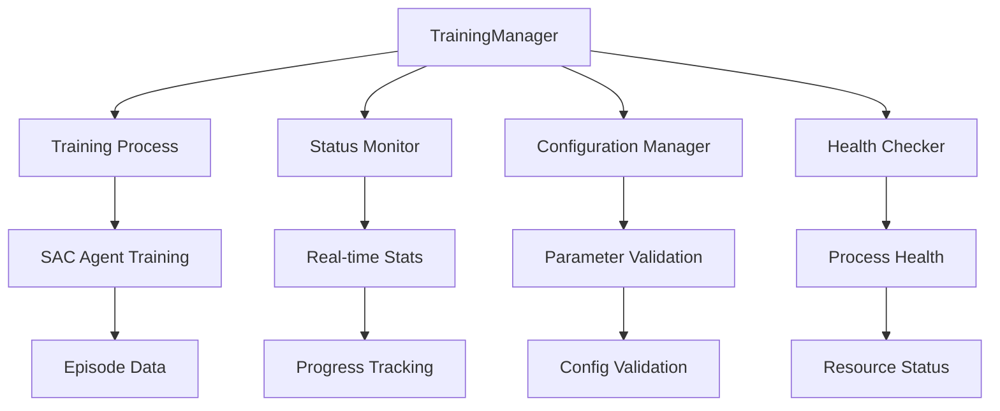

# Training Manager Module

> **Status**: `Official`  
> **Version**: v2.0.0  
> **Maintainer**: @ZhuoQiuMcgill  
> **Last Updated**: 2025-01-07  
> **Module**: `src.ui.training_manager`

## Table of Contents

- [Overview](#overview)
- [Architecture](#architecture)
- [Core Classes](#core-classes)
- [Configuration](#configuration)
- [API Integration](#api-integration)
- [Error Handling](#error-handling)
- [Development Guide](#development-guide)

## Overview

The Training Manager module provides a high-level abstraction for managing reinforcement learning training sessions. It handles the lifecycle of training processes, from initialization and execution to monitoring and cleanup.

**Key Responsibilities:**
- **Process Management**: Start/stop training processes
- **Status Monitoring**: Real-time training status tracking
- **Configuration Management**: Handle training parameters and settings  
- **Resource Management**: Process cleanup and resource allocation
- **Error Recovery**: Handle training failures and edge cases

## Architecture



### Component Relationships

- **TrainingManager**: Central coordinator for all training operations
- **Training Process**: Subprocess executing the actual RL training
- **Status Monitor**: Tracks training progress and performance metrics
- **Configuration Manager**: Validates and manages training parameters
- **Health Checker**: Monitors system resources and process health

---

## Core Classes

### TrainingManager

```python
class TrainingManager:
    """
    Central manager for training session lifecycle.
    
    Handles:
    - Training process spawning and management
    - Real-time status monitoring
    - Configuration validation
    - Resource cleanup
    """
    
    def __init__(self):
        self.current_process = None
        self.status_monitor = StatusMonitor()
        self.config_validator = ConfigValidator()
        self.is_running = False
    
    def start_training(self, config: Dict[str, Any]) -> Dict[str, Any]:
        """
        Start a new training session with given configuration.
        
        Args:
            config: Training configuration dictionary
                - mesh_name: str, optional
                - subfolder: str, default "mesh" 
                - max_timesteps: int, optional
                - max_steps: int, optional
                - description: str, optional
                - checkpoint_name: str, optional
                - from_checkpoint: bool, default False
        
        Returns:
            Dict containing start result and configuration
            
        Raises:
            RuntimeError: If training is already running
            ValueError: If configuration is invalid
        """
    
    def stop_training(self) -> Dict[str, Any]:
        """
        Stop the currently running training session.
        
        Returns:
            Dict containing stop result
            
        Raises:
            RuntimeError: If no training is currently running
        """
    
    def get_status(self) -> Dict[str, Any]:
        """
        Get comprehensive training status information.
        
        Returns:
            Dict containing:
            - running: bool
            - status: str ("running" | "idle" | "error")
            - stats: Optional[Dict] - training statistics
            - progress: Optional[Dict] - progress information
            - timestamp: float
        """
    
    def get_health_status(self) -> Dict[str, Any]:
        """
        Get health status of training service.
        
        Returns:
            Dict containing health information
        """
```

### StatusMonitor

```python
class StatusMonitor:
    """
    Monitors training process status and collects metrics.
    """
    
    def __init__(self):
        self.last_status = None
        self.monitoring_active = False
    
    def start_monitoring(self, process: subprocess.Popen):
        """Start monitoring a training process."""
    
    def stop_monitoring(self):
        """Stop monitoring current process."""
    
    def get_current_status(self) -> Optional[Dict[str, Any]]:
        """Get latest training status from process."""
    
    def is_process_healthy(self) -> bool:
        """Check if monitored process is healthy."""
```

### ConfigValidator  

```python
class ConfigValidator:
    """
    Validates training configuration parameters.
    """
    
    def validate_config(self, config: Dict[str, Any]) -> Dict[str, Any]:
        """
        Validate and normalize training configuration.
        
        Args:
            config: Raw configuration dictionary
            
        Returns:
            Validated and normalized configuration
            
        Raises:
            ValueError: If configuration is invalid
        """
    
    def validate_mesh_config(self, mesh_name: str, subfolder: str) -> bool:
        """Validate mesh file exists and is accessible."""
    
    def validate_checkpoint_config(self, checkpoint_name: str) -> bool:
        """Validate checkpoint exists and is valid."""
    
    def validate_training_params(self, params: Dict[str, Any]) -> Dict[str, Any]:
        """Validate training hyperparameters."""
```

---

## Configuration

### Default Configuration

```python
DEFAULT_TRAINING_CONFIG = {
    "mesh_name": None,
    "subfolder": "mesh", 
    "max_timesteps": None,
    "max_steps": None,
    "description": None,
    "checkpoint_name": None,
    "from_checkpoint": False,
    
    # Process configuration
    "timeout": 3600,  # 1 hour timeout
    "status_poll_interval": 1.0,  # 1 second
    "health_check_interval": 30.0,  # 30 seconds
    
    # Resource limits
    "max_memory_mb": 4096,
    "max_cpu_percent": 80.0
}
```

### Configuration Validation Rules

```python
VALIDATION_RULES = {
    "mesh_name": {
        "type": [str, type(None)],
        "validator": "validate_mesh_exists"
    },
    "subfolder": {
        "type": str,
        "default": "mesh"
    },
    "max_timesteps": {
        "type": [int, type(None)],
        "min": 1000,
        "max": 10000000
    },
    "max_steps": {
        "type": [int, type(None)], 
        "min": 100,
        "max": 10000
    },
    "from_checkpoint": {
        "type": bool,
        "default": False
    }
}
```

### Environment Variables

```bash
# Training configuration
TRAINING_TIMEOUT=3600
TRAINING_MAX_MEMORY=4096
TRAINING_MAX_CPU=80.0

# Monitoring configuration  
STATUS_POLL_INTERVAL=1.0
HEALTH_CHECK_INTERVAL=30.0

# File paths
MESH_DATA_DIR=data/mesh
CHECKPOINT_DIR=data/checkpoints
RESULTS_DIR=data/results
```

---

## API Integration

### Blueprint Integration

```python
# training.py (Flask blueprint)
from src.ui.training_manager import get_training_manager

training_bp = Blueprint("training", __name__, url_prefix="/training")

@training_bp.route("/start", methods=["POST"])
def start_training():
    try:
        data = request.get_json() or {}
        config = extract_training_config(data)
        
        manager = get_training_manager()
        result = manager.start_training(config)
        
        return jsonify(result), 200
        
    except RuntimeError as e:
        return jsonify({"error": str(e), "success": False}), 400
    except ValueError as e:
        return jsonify({"error": str(e), "success": False}), 400
    except Exception as e:
        return jsonify({"error": f"启动训练失败: {str(e)}", "success": False}), 500

def extract_training_config(data: Dict[str, Any]) -> Dict[str, Any]:
    """Extract and validate training config from request data."""
    return {
        "mesh_name": data.get("mesh_name"),
        "subfolder": data.get("subfolder", "mesh"),
        "max_timesteps": data.get("max_timesteps"),
        "max_steps": data.get("max_steps"), 
        "description": data.get("description"),
        "checkpoint_name": data.get("checkpoint_name"),
        "from_checkpoint": data.get("from_checkpoint", False)
    }
```

### Singleton Pattern

```python
# training_manager.py
_training_manager_instance = None

def get_training_manager() -> TrainingManager:
    """
    Get singleton TrainingManager instance.
    
    Returns:
        TrainingManager: Singleton instance
    """
    global _training_manager_instance
    
    if _training_manager_instance is None:
        _training_manager_instance = TrainingManager()
    
    return _training_manager_instance
```

---

## Error Handling

### Exception Hierarchy

```python
class TrainingManagerError(Exception):
    """Base exception for training manager errors."""
    pass

class TrainingAlreadyRunningError(TrainingManagerError):
    """Raised when attempting to start training while already running."""
    pass

class TrainingNotRunningError(TrainingManagerError):
    """Raised when attempting to stop training when not running."""
    pass

class ConfigurationError(TrainingManagerError):
    """Raised when training configuration is invalid."""
    pass

class ProcessError(TrainingManagerError):
    """Raised when training process encounters an error."""
    pass

class ResourceError(TrainingManagerError):
    """Raised when system resources are insufficient."""
    pass
```

### Error Recovery Strategies

```python
class ErrorRecovery:
    """Handles error recovery for training processes."""
    
    @staticmethod
    def handle_process_crash(manager: TrainingManager, error: Exception):
        """Handle training process crashes."""
        logger.error(f"Training process crashed: {error}")
        
        # Clean up resources
        manager._cleanup_process()
        
        # Reset status
        manager.is_running = False
        manager.current_process = None
        
        # Log crash details
        manager._log_crash_details(error)
    
    @staticmethod  
    def handle_resource_exhaustion(manager: TrainingManager):
        """Handle system resource exhaustion."""
        logger.warning("System resources exhausted, stopping training")
        
        try:
            manager.stop_training()
        except Exception as e:
            logger.error(f"Failed to gracefully stop training: {e}")
            manager._force_stop_training()
    
    @staticmethod
    def handle_configuration_error(config: Dict[str, Any], error: ValueError):
        """Handle configuration validation errors."""
        logger.error(f"Configuration error: {error}")
        
        # Attempt to fix common configuration issues
        fixed_config = ErrorRecovery._attempt_config_fix(config, error)
        
        if fixed_config:
            logger.info("Configuration automatically fixed")
            return fixed_config
        else:
            raise ConfigurationError(f"Cannot fix configuration: {error}")
```

---

## Development Guide

### Adding New Training Parameters

1. **Update Configuration Schema**:
   ```python
   # Add to DEFAULT_TRAINING_CONFIG
   "new_parameter": default_value,
   
   # Add validation rule
   VALIDATION_RULES["new_parameter"] = {
       "type": expected_type,
       "validator": "custom_validator",
       "default": default_value
   }
   ```

2. **Implement Validator**:
   ```python
   def validate_new_parameter(self, value):
       """Validate new parameter value."""
       if not self._is_valid_parameter(value):
           raise ValueError(f"Invalid parameter value: {value}")
       return value
   ```

3. **Update Process Spawning**:
   ```python
   def _build_training_command(self, config):
       cmd = ["python", "train.py"]
       
       if config.get("new_parameter"):
           cmd.extend(["--new-parameter", str(config["new_parameter"])])
       
       return cmd
   ```

### Custom Status Monitoring

```python
class CustomStatusMonitor(StatusMonitor):
    """Custom status monitor with additional metrics."""
    
    def __init__(self):
        super().__init__()
        self.custom_metrics = {}
    
    def collect_custom_metrics(self) -> Dict[str, Any]:
        """Collect additional training metrics."""
        return {
            "gpu_utilization": self._get_gpu_utilization(),
            "memory_usage": self._get_memory_usage(),
            "disk_io": self._get_disk_io_stats()
        }
    
    def _get_gpu_utilization(self) -> float:
        """Get current GPU utilization percentage."""
        # Implementation depends on GPU monitoring library
        pass
```

### Testing

```python
# test_training_manager.py
import pytest
from unittest.mock import Mock, patch
from src.ui.training_manager import TrainingManager

class TestTrainingManager:
    
    @pytest.fixture
    def manager(self):
        return TrainingManager()
    
    def test_start_training_success(self, manager):
        config = {
            "mesh_name": "test_mesh",
            "max_timesteps": 1000
        }
        
        with patch('subprocess.Popen') as mock_popen:
            result = manager.start_training(config)
            
            assert result["success"] == True
            assert manager.is_running == True
    
    def test_start_training_already_running(self, manager):
        manager.is_running = True
        
        with pytest.raises(RuntimeError, match="Training already running"):
            manager.start_training({})
    
    def test_config_validation(self, manager):
        invalid_config = {
            "max_timesteps": -1  # Invalid value
        }
        
        with pytest.raises(ValueError):
            manager.start_training(invalid_config)
    
    @patch('psutil.Process')
    def test_resource_monitoring(self, mock_process, manager):
        mock_process.return_value.memory_info.return_value.rss = 1024 * 1024  # 1MB
        
        health = manager.get_health_status()
        assert "memory_usage" in health
```

### Performance Optimization

1. **Process Pooling**: Reuse training processes for multiple sessions
2. **Lazy Loading**: Load heavy resources only when needed  
3. **Caching**: Cache frequently accessed configuration data
4. **Async Monitoring**: Use async/await for non-blocking status checks

### Integration Points

```python
# Integrate with checkpoint manager
from src.utils.checkpoint_manager import get_checkpoint_manager

def _validate_checkpoint_config(self, config):
    if config.get("from_checkpoint"):
        checkpoint_manager = get_checkpoint_manager()
        if not checkpoint_manager.validate_checkpoint(config["checkpoint_name"]):
            raise ValueError(f"Invalid checkpoint: {config['checkpoint_name']}")

# Integrate with history manager  
from src.rl.training.history_manager import HistoryManager

def _setup_history_tracking(self, config):
    history_manager = HistoryManager()
    training_id = self._generate_training_id(config)
    history_manager.start_session(training_id, config)
    return training_id
```

### Best Practices

1. **Resource Cleanup**: Always clean up processes and resources
2. **Error Logging**: Log errors with sufficient detail for debugging
3. **Configuration Validation**: Validate all input parameters
4. **Process Monitoring**: Monitor process health and resources
5. **Graceful Shutdown**: Implement graceful training termination
6. **Thread Safety**: Use appropriate locking for concurrent access
7. **Memory Management**: Monitor and limit memory usage
8. **Timeout Handling**: Set appropriate timeouts for operations
