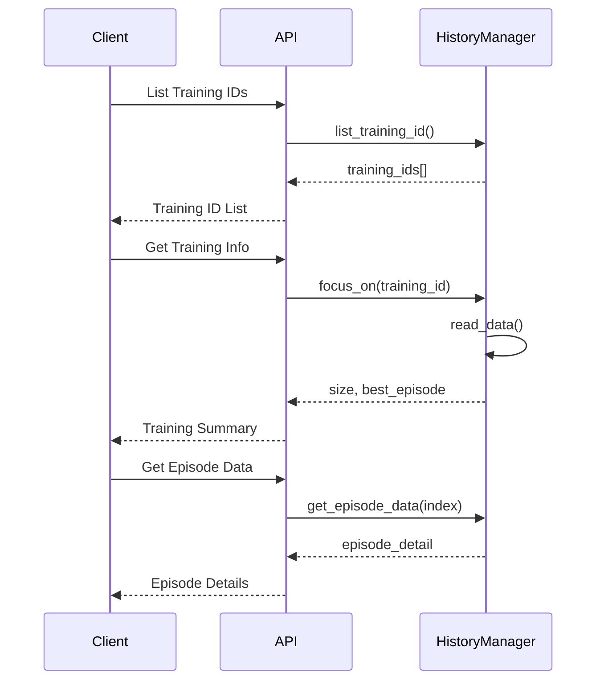

# Training History Management API

> **Status**: `Official`  
> **Version**: v1.0.0  
> **Maintainer**: @ZhuoQiuMcgill  
> **Last Updated**: 2025-01-16

## Table of Contents

- [Overview](#overview)
- [Base URL](#base-url)
- [Training History APIs](#training-history-apis)
    - [List Training History](#list-training-history)
    - [Get Training Information](#get-training-information)
    - [Get Episode Data](#get-episode-data)
    - [Health Check](#health-check)
- [Error Codes](#error-codes)
- [Data Models](#data-models)
- [Appendix](#appendix)

## Overview

The Training History Management API provides endpoints for querying and retrieving historical training session data. It
allows users to access episode details, training statistics, and session metadata from completed or ongoing
reinforcement learning training sessions.

The API supports three main operations:

- **Session Discovery**: List all available training sessions
- **Session Summary**: Get basic information about a specific training session
- **Episode Details**: Retrieve detailed data for individual episodes



## Base URL

```
http://127.0.0.1:5000
```

---

## Training History APIs

### List Training History

Retrieves a list of all available training session IDs.

#### Request Endpoint

```http
GET /training/history/list
```

#### Request Parameters

No parameters required.

#### Response Examples

##### Success Response (200 OK)

```json
{
  "training_ids": [
    "sac_20250116_143022_simple_square",
    "continue_checkpoint1_20250116_150030_triangle",
    "sac_20250115_091500_pentagon"
  ],
  "count": 3,
  "success": true
}
```

##### Failure Response (500 Internal Server Error)

```json
{
  "error": "获取训练历史列表失败: Directory access denied",
  "training_ids": [],
  "count": 0,
  "success": false
}
```

---

### Get Training Information

Retrieves basic information about a specific training session, including the total number of episodes (detail length)and
the best performing episode index.

#### Request Endpoint

```http
POST /training/history/info/{training_id}
```

#### Request Parameters

##### Path Parameters

| Parameter       | Type   | Description                        |
|-----------------|--------|------------------------------------|
| **training_id** | string | Unique training session identifier |

#### Response Examples

##### Success Response (200 OK)

```json
{
  "training_id": "sac_20250116_143022_simple_square",
  "detail_length": 1000,
  "best_episode": 847,
  "success": true
}
```

##### Training Not Found (404 Not Found)

```json
{
  "error": "训练历史不存在: invalid_training_id",
  "training_id": "invalid_training_id",
  "success": false
}
```

##### Failure Response (500 Internal Server Error)

```json
{
  "error": "获取训练信息失败: File corruption detected",
  "training_id": "sac_20250116_143022_simple_square",
  "success": false
}
```

---

### Get Episode Data

Retrieves detailed data for a specific episode within a training session.

#### Request Endpoint

```http
POST /training/history/episode/{training_id}/{episode_index}
```

#### Request Parameters

##### Path Parameters

| Parameter         | Type    | Description                        |
|-------------------|---------|------------------------------------|
| **training_id**   | string  | Unique training session identifier |
| **episode_index** | integer | Episode index (0-based)            |

#### Response Examples

##### Success Response (200 OK)

```json
{
  "training_id": "sac_20250116_143022_simple_square",
  "episode_index": 150,
  "episode_data": {
    "r": 0.842,
    "l": 98,
    "mesh_data": {
      "[0.0,0.0]": [
        [
          1.0,
          0.0
        ],
        [
          0.0,
          1.0
        ]
      ],
      "[1.0,0.0]": [
        [
          2.0,
          0.0
        ],
        [
          1.0,
          1.0
        ]
      ]
    },
    "boundary_vertices_data": [
      [
        0.0,
        0.0
      ],
      [
        2.0,
        0.0
      ],
      [
        2.0,
        2.0
      ],
      [
        0.0,
        2.0
      ]
    ],
    "last_ref_point": {
      "ref_vertex": [
        1.0,
        1.0
      ],
      "local_env_vertices": [
        [
          0.0,
          1.0
        ],
        [
          1.0,
          1.0
        ],
        [
          2.0,
          1.0
        ]
      ]
    },
    "is_completed": false
  },
  "success": true
}
```

##### Episode Index Out of Range (400 Bad Request)

```json
{
  "error": "Episode索引超出范围: 1500",
  "training_id": "sac_20250116_143022_simple_square",
  "episode_index": 1500,
  "success": false
}
```

##### Training Not Found (404 Not Found)

```json
{
  "error": "训练历史不存在: invalid_training_id",
  "training_id": "invalid_training_id",
  "episode_index": 150,
  "success": false
}
```

##### HistoryManager Not Focused (500 Internal Server Error)

```json
{
  "error": "HistoryManager未聚焦: HistoryManager is not focused on any training ID",
  "training_id": "sac_20250116_143022_simple_square",
  "episode_index": 150,
  "success": false
}
```

---

### Health Check

Checks the health status of the training history management service.

#### Request Endpoint

```http
GET /training/history/health
```

#### Request Parameters

No parameters required.

#### Response Examples

##### Success Response (200 OK)

```json
{
  "status": "healthy",
  "service": "training-history-api",
  "available_trainings": 5,
  "current_focus": "sac_20250116_143022_simple_square",
  "timestamp": 1641888000.123
}
```

##### Failure Response (500 Internal Server Error)

```json
{
  "status": "unhealthy",
  "service": "training-history-api",
  "error": "健康检查失败: Database connection failed",
  "timestamp": 1641888000.123
}
```

---

## Error Codes

| Error Code | HTTP Status Code          | Description                                     |
|------------|---------------------------|-------------------------------------------------|
| 400        | 400 Bad Request           | Episode index out of range                      |
| 404        | 404 Not Found             | Training session not found                      |
| 500        | 500 Internal Server Error | Internal error (file corruption, access denied) |

### Common Error Response Format

```json
{
  "error": "Error description",
  "success": false
}
```

---

## Data Models

### Episode Data Model

The episode data contains detailed information about a single training episode:

```json
{
  "r": "float",
  // Episode reward
  "l": "integer",
  // Episode length (number of steps)
  "mesh_data": "object",
  // Mesh adjacency data
  "boundary_vertices_data": "array",
  // Boundary vertices coordinates
  "last_ref_point": "object",
  // Reference point information
  "is_completed": "boolean"
  // Whether the episode completed successfully
}
```

### Mesh Data Model

Mesh data represents the adjacency relationships between vertices:

```json
{
  "[x,y]": [
    [
      neighbor1_x,
      neighbor1_y
    ],
    [
      neighbor2_x,
      neighbor2_y
    ]
  ]
}
```

### Reference Point Info Model

Reference point information includes the reference vertex and its local environment:

```json
{
  "ref_vertex": [
    x,
    y
  ],
  "local_env_vertices": [
    [
      vertex1_x,
      vertex1_y
    ],
    [
      vertex2_x,
      vertex2_y
    ],
    [
      vertex3_x,
      vertex3_y
    ]
  ]
}
```

### Boundary Vertices Data Model

An array of coordinate pairs representing the boundary vertices:

```json
[
  [
    x1,
    y1
  ],
  [
    x2,
    y2
  ],
  [
    x3,
    y3
  ]
]
```

---

## Appendix

### Notes

1. **Training ID Format**: Training IDs typically follow the pattern `{algorithm}_{timestamp}_{mesh_name}`
   or `continue_{checkpoint}_{timestamp}_{mesh_name}` for checkpoint-resumed sessions.

2. **Episode Indexing**: Episodes are indexed starting from 0. The maximum valid index is `detail_length - 1`.

3. **Focus Mechanism**: The HistoryManager uses a focus mechanism internally to manage which training session is
   currently being queried. Each API call automatically focuses on the requested training session.

4. **Data Persistence**: Training history data is stored in JSON format under the `data/history/{training_id}/`directory
   structure.

5. **Error Handling**: All endpoints include comprehensive error handling with descriptive error messages in both
   English and Chinese.

### File Structure

```
data/history/{training_id}/
├── history/
│   └── details.json          # Episode data storage
├── model/                    # Saved model files
├── plot/                     # Training plots
└── exports/                  # Exported data
```

### Episode Data Structure in Storage

The `details.json` file follows this structure:

```json
{
  "size": 1000,
  "best_episode": 847,
  "details": [
    {
      "r": 0.125,
      "l": 45,
      "mesh_data": {
        ...
      },
      "boundary_vertices_data": [
        ...
      ],
      "last_ref_point": {
        ...
      },
      "is_completed": false
    }
  ]
}
```

### Usage Examples

#### Python Client Example

```python
import requests

base_url = "http://127.0.0.1:5000"

# List all training sessions
response = requests.get(f"{base_url}/training/history/list")
training_ids = response.json()["training_ids"]

# Get training info
training_id = training_ids[0]
response = requests.post(f"{base_url}/training/history/info/{training_id}")
info = response.json()

# Get specific episode data
episode_index = info["best_episode"]
response = requests.post(f"{base_url}/training/history/episode/{training_id}/{episode_index}")
episode_data = response.json()["episode_data"]
```

#### JavaScript Client Example

```javascript
const baseUrl = "http://127.0.0.1:5000";

// List training sessions
const listResponse = await fetch(`${baseUrl}/training/history/list`);
const {training_ids} = await listResponse.json();

// Get training info
const infoResponse = await fetch(`${baseUrl}/training/history/info/${training_ids[0]}`, {
    method: 'POST'
});
const trainingInfo = await infoResponse.json();

// Get episode data
const episodeResponse = await fetch(
    `${baseUrl}/training/history/episode/${training_ids[0]}/${trainingInfo.best_episode}`,
    {method: 'POST'}
);
const episodeData = await episodeResponse.json();
```

### Version History

- v1.0.0 (2025-07-16): Initial API version with basic training history management functionality

### Development Environment

- **Base URL**: `http://localhost:5000`
- **Data Directory**: `data/history/` (relative to project root)
- **Dependencies**: Flask, HistoryManager module