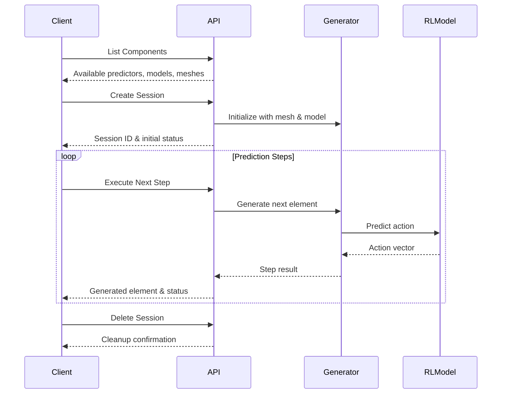
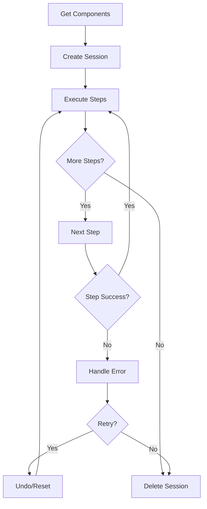

# Predict API

> **Status**: `Official`  
> **Version**: v1.0.0  
> **Maintainer**: @Claude  
> **Last Updated**: 2025-07-30

## Table of Contents
- [Overview](#overview)
- [Base Configuration](#base-configuration)
- [Components API](#components-api)
- [Session Management API](#session-management-api)
- [Prediction Execution API](#prediction-execution-api)
- [Session Monitoring API](#session-monitoring-api)
- [Error Codes](#error-codes)
- [Usage Workflow](#usage-workflow)
- [Appendix](#appendix)

## Overview

The Predict API provides a comprehensive interface for mesh generation prediction using trained reinforcement learning models. It supports session-based prediction with reversible operations, allowing users to step through the mesh generation process interactively or in batch mode. The API integrates trained SAC (Soft Actor-Critic) models with customizable reference point selectors for optimal mesh generation.



## Base Configuration

### Request Endpoint Base
```http
Base URL: /predict
Content-Type: application/json
```

### Common Response Format
All API responses follow this structure:
```json
{
  "success": true|false,
  "data": { /* endpoint-specific data */ },
  "error": "error message (only when success=false)",
  "timestamp": 1640995200.0
}
```

## Components API

### List Available Components

#### Request Endpoint
```http
GET /predict/components
```

#### Request Parameters
No parameters required.

#### Response Examples

##### Success Response (200 OK)
```json
{
  "predictors": {
    "RL": {
      "name": "RL",
      "description": "Reinforcement Learning predictor using trained SAC model",
      "parameters": ["n", "g", "beta"]
    }
  },
  "reference_selectors": {
    "RL": {
      "name": "RL",
      "description": "RL-based reference point selector (minimum interior angle)",
      "parameters": ["n"]
    },
    "default": {
      "name": "default",
      "description": "Default boundary reference point selector",
      "parameters": []
    }
  },
  "initial_meshes": ["basic1.txt", "basic2.txt", "dolphine3.txt"],
  "trained_models": [
    {
      "name": "basic1-reward68.026.zip",
      "path": "data/models/basic1-reward68.026.zip",
      "size": 1621539,
      "description": "Trained SAC model: basic1-reward68.026.zip"
    }
  ],
  "success": true
}
```

##### Failure Response (500 Internal Server Error)
```json
{
  "error": "Failed to list components: filesystem error",
  "success": false
}
```

## Session Management API

### Create Prediction Session

#### Request Endpoint
```http
POST /predict/session/create
```

#### Request Parameters

##### Body Parameters
```json
{
  "mesh_name": "***Required***",
  "predictor_type": "***Required***",
  "predictor_config": {
    "model_path": "***Required for RL predictor***",
    "n": 2,
    "g": 3,
    "beta": 6
  },
  "ref_selector_type": "RL",
  "ref_selector_config": {
    "n": 2
  }
}
```

| Parameter | Type | Required | Default | Description |
|-----------|------|----------|---------|-------------|
| **mesh_name** | string | Yes | - | Initial mesh file name (e.g., "basic1.txt") |
| **predictor_type** | string | Yes | - | Predictor type ("RL") |
| **predictor_config** | object | Yes | - | Predictor configuration |
| **predictor_config.model_path** | string | Yes for RL | - | Path to trained SAC model (.zip file) |
| **predictor_config.n** | integer | No | 2 | Number of neighbor vertices |
| **predictor_config.g** | integer | No | 3 | Number of observation points in fan region |
| **predictor_config.beta** | integer | No | 6 | State observation radius factor |
| ref_selector_type | string | No | "default" | Reference point selector type |
| ref_selector_config | object | No | {} | Reference selector configuration |

#### Response Examples

##### Success Response (200 OK)
```json
{
  "session_id": "session_0_123456789",
  "initial_status": {
    "current_step": 0,
    "boundary_size": 38,
    "generated_elements_count": 0,
    "is_completed": false,
    "active_predictor": "RL",
    "can_undo": false,
    "total_steps_possible": 34
  },
  "config": {
    "mesh_name": "basic1.txt",
    "predictor_type": "RL",
    "predictor_config": {
      "model_path": "data/models/basic1-reward68.026.zip",
      "n": 2,
      "g": 3,
      "beta": 6
    },
    "ref_selector_type": "RL",
    "ref_selector_config": {"n": 2}
  },
  "success": true
}
```

##### Failure Response (400 Bad Request)
```json
{
  "error": "Missing required field: mesh_name",
  "success": false
}
```

##### Failure Response (500 Internal Server Error)
```json
{
  "error": "Failed to create session: FileNotFoundError: Model file not found",
  "success": false
}
```

### Update Session Configuration

#### Request Endpoint
```http
PUT /predict/session/{session_id}/config
```

#### Request Parameters

##### Path Parameters
| Parameter | Type | Description |
|-----------|------|-------------|
| **session_id** | string | Session identifier |

##### Body Parameters
```json
{
  "predictor_type": "RL",
  "predictor_config": {
    "model_path": "data/models/new_model.zip",
    "n": 2,
    "g": 3,
    "beta": 6
  },
  "ref_selector_type": "default"
}
```

#### Response Examples

##### Success Response (200 OK)
```json
{
  "session_id": "session_0_123456789",
  "status": {
    "current_step": 0,
    "boundary_size": 38,
    "active_predictor": "RL"
  },
  "config": {
    "predictor_type": "RL",
    "ref_selector_type": "default"
  },
  "success": true
}
```

### Delete Session

#### Request Endpoint
```http
DELETE /predict/session/{session_id}
```

#### Request Parameters

##### Path Parameters
| Parameter | Type | Description |
|-----------|------|-------------|
| **session_id** | string | Session identifier |

#### Response Examples

##### Success Response (200 OK)
```json
{
  "message": "Session session_0_123456789 deleted successfully",
  "success": true
}
```

##### Failure Response (404 Not Found)
```json
{
  "error": "Session not found: invalid_session_id",
  "success": false
}
```

## Prediction Execution API

### Execute Next Step

#### Request Endpoint
```http
POST /predict/session/{session_id}/next
```

#### Request Parameters

##### Path Parameters
| Parameter | Type | Description |
|-----------|------|-------------|
| **session_id** | string | Session identifier |

#### Response Examples

##### Success Response (200 OK)
```json
{
  "session_id": "session_0_123456789",
  "step_result": {
    "success": true,
    "element": [[0.0, 0.0], [1.0, 0.0], [1.0, 1.0], [0.0, 1.0]],
    "message": "Successfully executed action type1",
    "action_info": {
      "action_type": "type1",
      "reference_vertex_idx": 15,
      "new_coords": [[0.5, 0.5]],
      "is_valid": true,
      "validation_message": null
    }
  },
  "status": {
    "current_step": 1,
    "boundary_size": 37,
    "generated_elements_count": 1,
    "is_completed": false,
    "can_undo": true
  },
  "success": true
}
```

##### Action Failed Response (200 OK)
```json
{
  "session_id": "session_0_123456789",
  "step_result": {
    "success": false,
    "element": null,
    "message": "Invalid action type1 at reference vertex 15: insufficient boundary vertices",
    "action_info": {
      "action_type": "type1",
      "reference_vertex_idx": 15,
      "new_coords": [[0.2, 0.8]],
      "is_valid": false,
      "validation_message": "Cannot execute invalid action"
    }
  },
  "status": {
    "current_step": 5,
    "boundary_size": 4,
    "is_completed": true
  },
  "success": true
}
```

#### Action Info Structure

All step execution responses include an `action_info` object that provides detailed information about the action attempted by the RL model, regardless of whether the action was valid or invalid.

| Field | Type | Description |
|-------|------|-------------|
| **action_type** | string | Type of action attempted ("type0_left", "type0_right", "type1") |
| **reference_vertex_idx** | integer | Index of the reference vertex used for the action |
| **new_coords** | array\|null | New vertex coordinates for type1 actions, null for type0 actions |
| **is_valid** | boolean | Whether the action passed validation checks |
| **validation_message** | string\|null | Detailed error message if action was invalid, null if valid |

> 🎯 **Frontend Integration**: The `action_info` object enables frontends to visualize invalid actions, showing users exactly what the model attempted to do even when the action failed. This is crucial for debugging and understanding model behavior.

**Action Types:**
- **type0_left**: Connect left boundary vertices to form quadrilateral
- **type0_right**: Connect right boundary vertices to form quadrilateral  
- **type1**: Add new vertex at specified coordinates to form quadrilateral

### Undo Previous Step

#### Request Endpoint
```http
POST /predict/session/{session_id}/prev
```

#### Request Parameters

##### Path Parameters
| Parameter | Type | Description |
|-----------|------|-------------|
| **session_id** | string | Session identifier |

#### Response Examples

##### Success Response (200 OK)
```json
{
  "session_id": "session_0_123456789",
  "undo_result": {
    "success": true,
    "message": "Successfully undone step 3"
  },
  "status": {
    "current_step": 2,
    "boundary_size": 36,
    "generated_elements_count": 2,
    "can_undo": true
  },
  "success": true
}
```

##### No Steps to Undo Response (200 OK)
```json
{
  "session_id": "session_0_123456789",
  "undo_result": {
    "success": false,
    "message": "No steps to undo"
  },
  "status": {
    "current_step": 0,
    "can_undo": false
  },
  "success": true
}
```

### Process All Steps

#### Request Endpoint
```http
POST /predict/session/{session_id}/process_all?max_steps=100
```

#### Request Parameters

##### Path Parameters
| Parameter | Type | Description |
|-----------|------|-------------|
| **session_id** | string | Session identifier |

##### Query Parameters
| Parameter | Type | Required | Default | Description |
|-----------|------|----------|---------|-------------|
| max_steps | integer | No | 100 | Maximum number of steps to execute |

#### Response Examples

##### Success Response (200 OK)
```json
{
  "session_id": "session_0_123456789",
  "steps_executed": 15,
  "results": [
    {
      "success": true,
      "element": [[0.0, 0.0], [1.0, 0.0], [1.0, 1.0], [0.0, 1.0]],
      "message": "Successfully executed action type0_left",
      "action_info": {
        "action_type": "type0_left",
        "reference_vertex_idx": 5,
        "new_coords": null,
        "is_valid": true,
        "validation_message": null
      }
    },
    {
      "success": true,
      "element": [[1.0, 0.0], [2.0, 0.0], [1.5, 1.0]],
      "message": "Successfully executed action type1",
      "action_info": {
        "action_type": "type1",
        "reference_vertex_idx": 8,
        "new_coords": [[1.5, 1.0]],
        "is_valid": true,
        "validation_message": null
      }
    },
    {
      "success": false,
      "element": null,
      "message": "Invalid action type1 at reference vertex 2: insufficient boundary vertices",
      "action_info": {
        "action_type": "type1",
        "reference_vertex_idx": 2,
        "new_coords": [[0.3, 0.7]],
        "is_valid": false,
        "validation_message": "Cannot execute invalid action"
      }
    }
  ],
  "final_status": {
    "current_step": 15,
    "boundary_size": 4,
    "generated_elements_count": 14,
    "is_completed": true
  },
  "success": true
}
```

### Reset Session

#### Request Endpoint
```http
POST /predict/session/{session_id}/reset
```

#### Request Parameters

##### Path Parameters
| Parameter | Type | Description |
|-----------|------|-------------|
| **session_id** | string | Session identifier |

#### Response Examples

##### Success Response (200 OK)
```json
{
  "session_id": "session_0_123456789",
  "reset_result": {
    "success": true,
    "message": "Successfully reset to initial state"
  },
  "status": {
    "current_step": 0,
    "boundary_size": 38,
    "generated_elements_count": 0,
    "is_completed": false,
    "can_undo": false
  },
  "success": true
}
```

## Session Monitoring API

### Get Session Status

#### Request Endpoint
```http
GET /predict/session/{session_id}/status
```

#### Request Parameters

##### Path Parameters
| Parameter | Type | Description |
|-----------|------|-------------|
| **session_id** | string | Session identifier |

#### Response Examples

##### Success Response (200 OK)
```json
{
  "session_id": "session_0_123456789",
  "status": {
    "current_step": 5,
    "boundary_size": 33,
    "generated_elements_count": 5,
    "is_completed": false,
    "active_predictor": "RL",
    "can_undo": true,
    "total_steps_possible": 29
  },
  "config": {
    "mesh_name": "basic1.txt",
    "predictor_type": "RL",
    "ref_selector_type": "RL"
  },
  "success": true
}
```

### Get Session History

#### Request Endpoint
```http
GET /predict/session/{session_id}/history
```

#### Request Parameters

##### Path Parameters
| Parameter | Type | Description |
|-----------|------|-------------|
| **session_id** | string | Session identifier |

#### Response Examples

##### Success Response (200 OK)
```json
{
  "session_id": "session_0_123456789",
  "history": [
    {
      "action": "next",
      "result": {
        "success": true,
        "element": [[0.0, 0.0], [1.0, 0.0], [1.0, 1.0], [0.0, 1.0]],
        "message": "Successfully executed action type1"
      },
      "timestamp": 1640995200.0
    },
    {
      "action": "prev",
      "result": {
        "success": true,
        "message": "Successfully undone step 1"
      },
      "timestamp": 1640995260.0
    },
    {
      "action": "process_all",
      "result": {
        "steps_executed": 10,
        "total_results": 10,
        "final_result": {
          "success": false,
          "message": "Generation completed"
        }
      },
      "timestamp": 1640995300.0
    }
  ],
  "total_actions": 3,
  "success": true
}
```

### List All Sessions

#### Request Endpoint
```http
GET /predict/sessions
```

#### Request Parameters
No parameters required.

#### Response Examples

##### Success Response (200 OK)
```json
{
  "sessions": {
    "session_0_123456789": {
      "config": {
        "mesh_name": "basic1.txt",
        "predictor_type": "RL"
      },
      "status": {
        "current_step": 5,
        "boundary_size": 33,
        "generated_elements_count": 5,
        "is_completed": false
      },
      "history_length": 8
    },
    "session_1_987654321": {
      "config": {
        "mesh_name": "basic2.txt",
        "predictor_type": "RL"
      },
      "status": {
        "current_step": 0,
        "boundary_size": 20,
        "is_completed": false
      },
      "history_length": 0
    }
  },
  "total_sessions": 2,
  "success": true
}
```

### Get Session Reference Point

#### Request Endpoint
```http
GET /predict/session/{session_id}/reference_point
```

#### Request Parameters

##### Path Parameters
| Parameter | Type | Description |
|-----------|------|-------------|
| **session_id** | string | Session identifier |

##### Query Parameters
| Parameter | Type | Required | Description |
|-----------|------|----------|-------------|
| selector_type | string | No | Override selector type ("RL", "Random", "default") |
| selector_config | string | No | Override selector config as JSON string |

#### Response Examples

##### Success Response (200 OK)
```json
{
  "session_id": "session_0_123456789",
  "reference_point": {
    "reference_vertex_idx": 10,
    "reference_vertex_coords": [600.0, 300.0],
    "selector_info": {
      "type": "RL",
      "method": "RL-based reference point selector (minimum interior angle)",
      "config": {"n": 2}
    },
    "boundary_context": {
      "boundary_size": 38,
      "left_neighbor_idx": 9,
      "left_neighbor_coords": [593.338, 206.662],
      "right_neighbor_idx": 11,
      "right_neighbor_coords": [693.338, 393.338],
      "interior_angle": 89.99999999999994
    },
    "session_status": {
      "current_step": 0,
      "boundary_size": 38,
      "generated_elements_count": 0,
      "is_completed": false
    }
  },
  "success": true
}
```

### Preview Reference Point Selection

#### Request Endpoint
```http
POST /predict/reference_point/preview
```

#### Request Parameters

##### Body Parameters
```json
{
  "mesh_name": "***Required***",
  "ref_selector_type": "***Required***",
  "ref_selector_config": {}
}
```

| Parameter | Type | Required | Description |
|-----------|------|----------|-------------|
| **mesh_name** | string | Yes | Mesh file name (without .txt extension) |
| **ref_selector_type** | string | Yes | Reference selector type ("RL", "Random", "default") |
| ref_selector_config | object | No | Selector configuration parameters |

#### Response Examples

##### Success Response (200 OK)
```json
{
  "preview": {
    "mesh_name": "basic1",
    "reference_vertex_idx": 10,
    "reference_vertex_coords": [600.0, 300.0],
    "selector_info": {
      "type": "RL",
      "method": "RL-based reference point selector (minimum interior angle)",
      "config": {"n": 2}
    },
    "boundary_context": {
      "boundary_size": 38,
      "total_vertices": 38,
      "left_neighbor_idx": 9,
      "left_neighbor_coords": [593.338, 206.662],
      "right_neighbor_idx": 11,
      "right_neighbor_coords": [693.338, 393.338],
      "interior_angle": 89.99999999999994
    },
    "boundary_vertices": [
      [300.0, 0.0], [393.338, 106.662], [506.662, 206.662],
      [593.338, 206.662], [693.338, 393.338], [600.0, 300.0]
    ]
  },
  "success": true
}
```

##### Failure Response (400 Bad Request)
```json
{
  "error": "Missing required field: mesh_name",
  "success": false
}
```

### Health Check

#### Request Endpoint
```http
GET /predict/health
```

#### Request Parameters
No parameters required.

#### Response Examples

##### Success Response (200 OK)
```json
{
  "status": "healthy",
  "service": "predict-api",
  "active_sessions": 2,
  "timestamp": 1640995200.0
}
```

##### Failure Response (500 Internal Server Error)
```json
{
  "status": "unhealthy",
  "service": "predict-api",
  "error": "Database connection failed",
  "timestamp": 1640995200.0
}
```

## Error Codes

| Error Code | HTTP Status Code | Description | Cause |
|------------|------------------|-------------|-------|
| 400 | 400 | Missing required field | Required parameter not provided |
| 400 | 400 | Unknown predictor type | Invalid predictor_type value |
| 400 | 400 | RL predictor requires model_path | model_path missing for RL predictor |
| 400 | 400 | Unknown reference selector type | Invalid ref_selector_type value |
| 404 | 404 | Session not found | Invalid session_id |
| 404 | 404 | Mesh file not found | mesh_name does not exist |
| 404 | 404 | Model file not found | model_path does not exist |
| 500 | 500 | Failed to load model | SAC model loading error |
| 500 | 500 | Failed to initialize predictor | Predictor configuration error |
| 500 | 500 | Failed to execute step | Prediction execution error |
| 500 | 500 | Failed to list components | Filesystem or import error |

## Usage Workflow

### Basic Workflow


### Step-by-Step Usage

1. **Discovery Phase**
   ```http
   GET /predict/components
   ```
   - Get available predictors, models, and meshes
   - Choose appropriate configuration

2. **Session Creation**
   ```http
   POST /predict/session/create
   ```
   - Create session with selected mesh and model
   - Store session_id for subsequent requests

3. **Prediction Execution**
   - **Individual Steps**: `POST /predict/session/{id}/next`
   - **Batch Processing**: `POST /predict/session/{id}/process_all`
   - **Monitor Progress**: `GET /predict/session/{id}/status`

4. **Error Handling**
   - **Undo Failed Steps**: `POST /predict/session/{id}/prev`
   - **Reset Session**: `POST /predict/session/{id}/reset`
   - **Change Configuration**: `PUT /predict/session/{id}/config`

5. **Cleanup**
   ```http
   DELETE /predict/session/{id}
   ```

### Error Handling Best Practices

> 🚨 **Important**: Never mask errors. Always surface the exact error message to users for debugging.

1. **Session Creation Errors**
   - Validate all required fields before sending request
   - Check file existence (mesh and model files)
   - Handle model loading failures appropriately

2. **Step Execution Errors**
   - Distinguish between prediction failures and API errors
   - Show exact error messages from the model
   - Allow users to retry with different parameters

3. **Network Errors**
   - Implement proper timeout handling
   - Retry with exponential backoff for transient errors
   - Clear error messages for network issues

## Appendix

### Notes

1. **Session Persistence**: Sessions are stored in memory and will be lost on server restart.
2. **Model Requirements**: Only Stable-Baselines3 SAC models in .zip format are supported.
3. **Mesh Format**: Mesh files must be in the specific boundary format used by the system.
4. **Rate Limiting**: No explicit rate limiting, but sessions consume server memory.
5. **Concurrent Sessions**: Multiple sessions can run simultaneously with different configurations.

### Model File Structure
```
model.zip (Stable-Baselines3 SAC)
├── data.pkl          # Model parameters
├── pytorch_variables.pth  # PyTorch state dict
└── system_info.txt   # Environment information
```

### Mesh File Format
```
# boundary.txt format
x1 y1
x2 y2
x3 y3
...
# Vertices should form a closed boundary (clockwise)
```

### Version History
- v1.0.0 (2025-07-30): Initial version with RL predictor support
  - Session-based prediction API
  - SAC model integration
  - Reversible step execution
  - Batch processing support