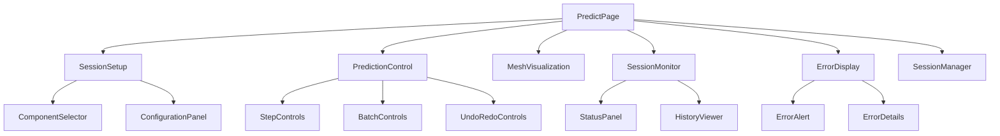
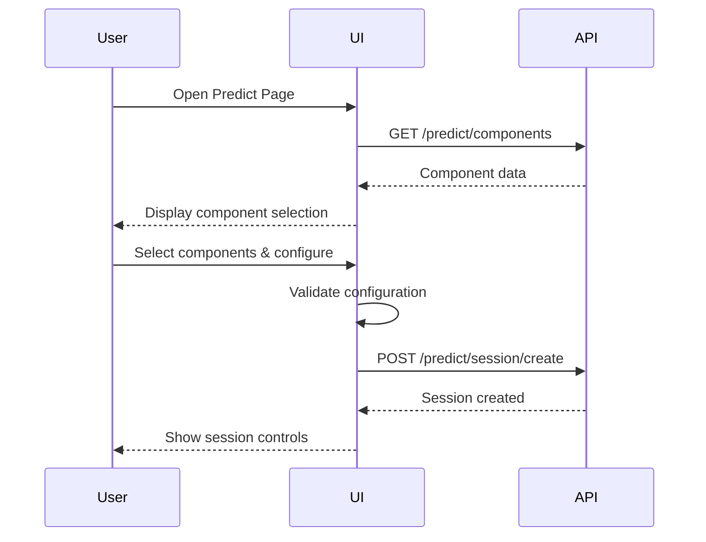
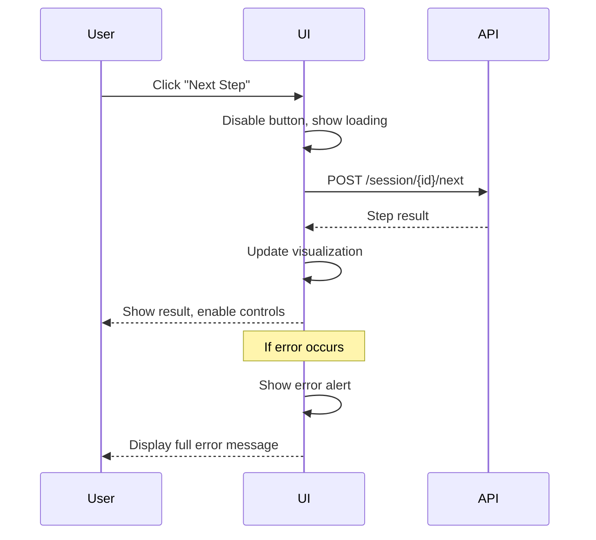
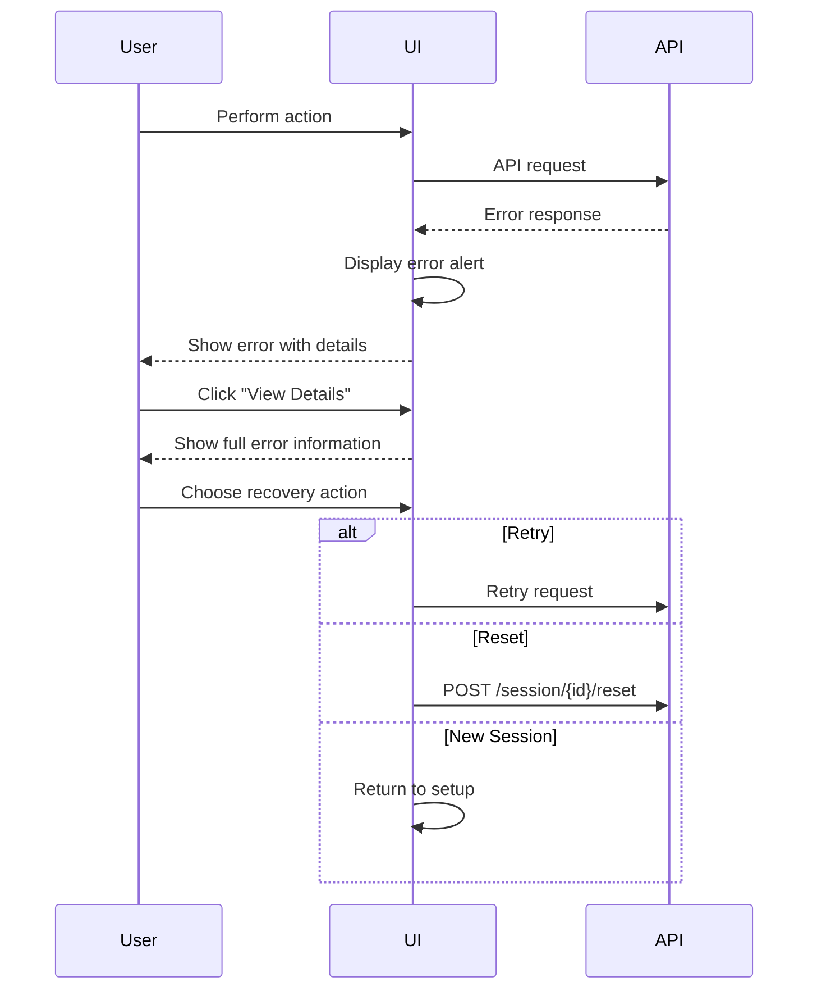

# Predict Frontend Development Guide

> **Document Type**: Development Requirements  
> **Target**: Frontend Developers  
> **Last Updated**: 2025-07-30

## Table of Contents
- [Overview](#overview)
- [Page Architecture](#page-architecture)
- [Component Requirements](#component-requirements)
- [API Integration Specifications](#api-integration-specifications)
- [Error Handling Requirements](#error-handling-requirements)
- [State Management](#state-management)
- [User Interaction Flow](#user-interaction-flow)
- [Performance Requirements](#performance-requirements)
- [Testing Requirements](#testing-requirements)

## Overview

This document outlines the functional requirements for developing a Predict Page that interfaces with the Predict API for interactive mesh generation. The page must provide users with full control over the prediction process, including session management, step-by-step execution, batch processing, and comprehensive error handling.

**Core Objectives:**
- Enable users to create and manage prediction sessions
- Provide real-time mesh generation visualization
- Support both manual step-by-step and automated batch prediction
- Implement robust error handling without masking any errors
- Maintain session state and history for debugging

## Page Architecture

### Primary Components Structure
```
PredictPage/
├── SessionSetup/           # Initial configuration
├── PredictionControl/      # Step execution controls
├── MeshVisualization/      # Real-time mesh display
├── SessionMonitor/         # Status and history display
├── ErrorDisplay/           # Error handling and messaging
└── SessionManager/         # Multi-session management
```

### Component Hierarchy


## Component Requirements

### 1. Session Setup Component

#### 1.1 Component Selector
**Purpose**: Display available components and allow user selection

**Required API Calls:**
```javascript
// On component mount
GET /predict/components
```

**Required Functionality:**
- Display available predictors with descriptions
- Show available reference selectors with parameter requirements
- List available mesh files with preview information
- Display trained models with metadata (size, description)
- Allow user to select one item from each category

**Data Display Requirements:**
- **Predictors**: Show name, description, and required parameters
- **Reference Selectors**: Show name, description, and parameter inputs
- **Meshes**: Show filename, optionally boundary vertex count if available
- **Models**: Show filename, file size, and any available metadata

**Validation Requirements:**
- Ensure all required selections are made before enabling session creation
- Validate parameter inputs according to component requirements
- Show real-time validation feedback

#### 1.2 Configuration Panel
**Purpose**: Configure predictor and reference selector parameters

**Required API Calls:**
```javascript
// Preview reference point selection
POST /predict/reference_point/preview
```

**Required Functionality:**
- Dynamic parameter input fields based on selected predictor
- Parameter validation with real-time feedback
- **Reference point preview** with visual indicator
- Configuration preview before session creation
- Save/load configuration presets (optional)

**Parameter Input Types:**
- **Integer inputs**: n, g, beta (with min/max validation)
- **File path inputs**: model_path (with file existence validation)
- **Selection inputs**: Dropdown for reference selector types

**Reference Point Preview Integration:**
```javascript
// Required reference point preview functionality
async function previewReferencePoint(meshName, selectorType, selectorConfig) {
  try {
    const response = await apiCall('/reference_point/preview', {
      method: 'POST',
      data: {
        mesh_name: meshName,
        ref_selector_type: selectorType,
        ref_selector_config: selectorConfig
      }
    });
    
    const preview = response.preview;
    
    // Update visualization
    highlightReferenceVertex({
      index: preview.reference_vertex_idx,
      coords: preview.reference_vertex_coords,
      interior_angle: preview.boundary_context.interior_angle,
      neighbors: {
        left: preview.boundary_context.left_neighbor_coords,
        right: preview.boundary_context.right_neighbor_coords
      }
    });
    
    // Show selector information
    displaySelectorInfo({
      type: preview.selector_info.type,
      method: preview.selector_info.method,
      config: preview.selector_info.config
    });
    
    return preview;
  } catch (error) {
    handleAPIError(error);
  }
}

// Update preview when selector configuration changes
function onSelectorConfigChange(selectorType, config) {
  const meshName = getCurrentSelectedMesh();
  if (meshName && selectorType) {
    previewReferencePoint(meshName, selectorType, config);
  }
}
```

### 2. Prediction Control Component

#### 2.1 Step Controls
**Purpose**: Manual step-by-step prediction execution

**Required API Calls:**
```javascript
// Execute next step
POST /predict/session/{session_id}/next

// Undo previous step
POST /predict/session/{session_id}/prev

// Get current status
GET /predict/session/{session_id}/status
```

**Required Functionality:**
- **Next Step Button**:
  - Disabled when session is completed or no session exists
  - Show loading state during API call
  - Display step result immediately
- **Previous Step Button (Undo)**:
  - Disabled when no steps to undo
  - Confirm action before execution
  - Update visualization after undo
- **Status Refresh**:
  - Automatic status updates after each step
  - Manual refresh capability
  - Real-time status display

**Button States:**
- **Enabled**: Available for execution
- **Disabled**: Not available (with tooltip explaining why)
- **Loading**: Request in progress
- **Error**: Last request failed (with error details)

#### 2.2 Batch Controls
**Purpose**: Automated batch prediction processing

**Required API Calls:**
```javascript
// Process all steps
POST /predict/session/{session_id}/process_all?max_steps=N
```

**Required Functionality:**
- **Process All Button**:
  - Configurable max_steps parameter
  - Progress indication during batch processing
  - Ability to cancel/stop processing
- **Batch Configuration**:
  - Max steps input field (default: 100)
  - Option to stop on first error vs continue
  - Processing speed control (delay between visualizations)

**Progress Display:**
- Current step number / total steps
- Success/failure count
- Estimated time remaining
- Real-time mesh updates

#### 2.3 Session Control
**Purpose**: Session lifecycle management

**Required API Calls:**
```javascript
// Create new session
POST /predict/session/create

// Reset current session
POST /predict/session/{session_id}/reset

// Delete session
DELETE /predict/session/{session_id}

// Update session configuration
PUT /predict/session/{session_id}/config
```

**Required Functionality:**
- **Create Session**: Use current configuration to create new session
- **Reset Session**: Return to initial state, clear history
- **Delete Session**: Clean up resources, return to setup
- **Update Configuration**: Change predictor or reference selector mid-session

### 3. Mesh Visualization Component

#### 3.1 Real-time Display
**Purpose**: Visual representation of mesh generation progress

**Required Functionality:**
- Display current boundary vertices
- Show generated mesh elements
- Highlight recently generated elements
- **Visualize attempted actions** (both valid and invalid)
- Support zoom, pan, and reset view
- Export visualization as image

**Visualization Requirements:**
- **Boundary**: Display as connected line segments, distinct color
- **Elements**: Display as filled polygons with edge outlines
- **Progress**: Different colors for old vs new elements
- **Reference Points**: Highlight current reference vertex from action_info
- **Invalid Actions**: Show attempted actions that failed validation
  - For type1: Display attempted new vertex position with distinct styling
  - For type0: Highlight involved boundary vertices
  - Use different colors/patterns to indicate invalid attempts
- **Animation**: Smooth transitions between steps

**Action Visualization from action_info:**
```javascript
// Example: Visualizing action attempts
function visualizeActionAttempt(actionInfo, canvas) {
  const { action_type, reference_vertex_idx, new_coords, is_valid } = actionInfo;
  
  // Highlight reference vertex
  highlightVertex(reference_vertex_idx, is_valid ? 'green' : 'red');
  
  if (action_type === 'type1' && new_coords) {
    // Show attempted new vertex position
    drawAttemptedVertex(new_coords[0], is_valid ? 'green' : 'red');
    
    if (!is_valid) {
      // Add visual indication of why it failed
      showErrorIndicator(new_coords[0], actionInfo.validation_message);
    }
  }
  
  if (action_type.startsWith('type0')) {
    // Highlight boundary vertices involved in type0 action
    highlightType0Vertices(reference_vertex_idx, is_valid ? 'green' : 'red');
  }
}
```

#### 3.2 Mesh Statistics
**Purpose**: Display quantitative information about current mesh

**Data Sources**: Extracted from session status API responses

**Required Display:**
- Current boundary size
- Total generated elements
- Current step number
- Completion percentage
- **Last action attempt details** (from action_info)
- **Action success/failure statistics**
- Quality metrics (if available from API)

**Action Statistics Display:**
```javascript
// Example: Action statistics tracking
const actionStats = {
  total_attempts: 0,
  successful_actions: 0,
  failed_actions: 0,
  action_type_counts: {
    type0_left: { attempts: 0, successes: 0 },
    type0_right: { attempts: 0, successes: 0 },
    type1: { attempts: 0, successes: 0 }
  },
  failure_reasons: {}
};

function updateActionStats(actionInfo) {
  actionStats.total_attempts++;
  actionStats.action_type_counts[actionInfo.action_type].attempts++;
  
  if (actionInfo.is_valid) {
    actionStats.successful_actions++;
    actionStats.action_type_counts[actionInfo.action_type].successes++;
  } else {
    actionStats.failed_actions++;
    const reason = actionInfo.validation_message || 'Unknown';
    actionStats.failure_reasons[reason] = (actionStats.failure_reasons[reason] || 0) + 1;
  }
}
```

### 4. Session Monitor Component

#### 4.1 Status Panel
**Purpose**: Real-time session status information

**Required API Calls:**
```javascript
// Periodic status updates
GET /predict/session/{session_id}/status
```

**Required Functionality:**
- Display all status fields from API response
- Auto-refresh every N seconds during active prediction
- Visual indicators for session state (active, completed, error)
- Configuration display (current predictor, reference selector)
- **Reference point visualization** with current selector information

**Status Information Display:**
- **Current Step**: Progress indicator
- **Boundary Size**: Numerical and visual representation
- **Generated Elements**: Count and visual progress
- **Is Completed**: Clear completion indicator
- **Can Undo**: Undo availability status
- **Active Predictor**: Current predictor configuration
- **Current Reference Point**: Real-time reference point information

#### 4.1.1 Reference Point Monitor
**Purpose**: Display current reference point selection and context

**Required API Calls:**
```javascript
// Get current reference point information
GET /predict/session/{session_id}/reference_point

// Override reference point selector for testing
GET /predict/session/{session_id}/reference_point?selector_type=Random
```

**Required Functionality:**
- Display current reference vertex index and coordinates
- Show reference point selection method and configuration
- Display interior angle and neighbor information
- Allow temporary selector override for comparison
- Visual highlighting of reference point in mesh display

**Reference Point Display Requirements:**
```javascript
// Required reference point monitoring
function updateReferencePointDisplay(sessionId) {
  // Get current reference point
  const refPointInfo = await apiCall(`/session/${sessionId}/reference_point`);
  const refPoint = refPointInfo.reference_point;
  
  // Update UI displays
  updateReferencePointStats({
    vertex_index: refPoint.reference_vertex_idx,
    coordinates: refPoint.reference_vertex_coords,
    selector_type: refPoint.selector_info.type,
    selector_method: refPoint.selector_info.method,
    interior_angle: refPoint.boundary_context.interior_angle,
    neighbors: {
      left: refPoint.boundary_context.left_neighbor_coords,
      right: refPoint.boundary_context.right_neighbor_coords
    }
  });
  
  // Highlight in visualization
  highlightCurrentReferencePoint(refPoint);
}

// Allow selector comparison
async function compareSelectors(sessionId) {
  const selectors = ['RL', 'Random', 'default'];
  const comparisons = {};
  
  for (const selector of selectors) {
    const response = await apiCall(
      `/session/${sessionId}/reference_point?selector_type=${selector}`
    );
    comparisons[selector] = response.reference_point;
  }
  
  displaySelectorComparison(comparisons);
}
```

#### 4.2 History Viewer
**Purpose**: Display session execution history

**Required API Calls:**
```javascript
// Get session history
GET /predict/session/{session_id}/history
```

**Required Functionality:**
- Chronological list of all actions taken
- Expandable details for each history entry
- Filter by action type (next, prev, process_all, reset)
- Export history as JSON or text file

**History Entry Display:**
- **Timestamp**: Human-readable date/time
- **Action Type**: next, prev, process_all, reset
- **Result**: Success/failure status
- **Details**: Expandable detailed information
- **Error Messages**: Full error text when applicable

### 5. Error Display Component

#### 5.1 Error Alert System
**Purpose**: Immediate error notification and handling

**Required Functionality:**
- Display ALL errors without masking or simplification
- Different alert types: network errors, API errors, validation errors
- Persistent errors for debugging, dismissible for user experience
- Error categorization with suggested actions

**Error Display Requirements:**
- **Full Error Message**: Exact API error response
- **Error Code**: HTTP status and application error codes
- **Timestamp**: When error occurred
- **Context**: What action caused the error
- **Suggested Actions**: User options to resolve error

> 🚨 **Critical Requirement**: NEVER hide, simplify, or mask error messages. Users must see the complete error information for debugging purposes.

#### 5.2 Error Details Panel
**Purpose**: Comprehensive error information for debugging

**Required Functionality:**
- Collapsible detailed error information
- Stack traces when available from API
- Request/response data that caused error
- Error history with timestamps
- Copy error details to clipboard

**Debug Information:**
- **Request Details**: Method, URL, headers, body
- **Response Details**: Status code, headers, full response body
- **Session Context**: Current session state when error occurred
- **Browser Info**: User agent, browser version (for debugging)

### 6. Session Manager Component

#### 6.1 Multi-session Support
**Purpose**: Manage multiple concurrent prediction sessions

**Required API Calls:**
```javascript
// List all sessions
GET /predict/sessions
```

**Required Functionality:**
- Display all active sessions in a list/tab interface
- Switch between sessions without losing state
- Compare sessions side-by-side
- Bulk session operations (delete all, export all)

**Session List Display:**
- **Session ID**: Unique identifier
- **Configuration**: Mesh name, predictor type
- **Progress**: Current step, completion status
- **Last Activity**: Timestamp of last action
- **Actions**: Switch to, delete, duplicate

## Action Information Handling

### Action Info Structure
Every prediction step returns detailed `action_info` object containing:

```javascript
// Action info structure from API
const actionInfo = {
  action_type: "type1",              // "type0_left" | "type0_right" | "type1"
  reference_vertex_idx: 15,          // Index of reference vertex
  new_coords: [[0.5, 0.5]],         // For type1 only, null for type0
  is_valid: false,                   // Whether action passed validation
  validation_message: "Cannot execute invalid action"  // Error details if invalid
};
```

### Required Action Info Processing

#### 1. Action Visualization
**Purpose**: Show users what the model attempted, regardless of success

```javascript
// Required action visualization handler
function handleActionInfo(actionInfo, stepResult) {
  // Always update visualization with attempted action
  visualizeActionAttempt(actionInfo);
  
  // Update action history
  addActionToHistory(actionInfo, stepResult.success);
  
  // Update statistics
  updateActionStats(actionInfo);
  
  if (!actionInfo.is_valid) {
    // Show error details for invalid actions
    displayActionError(actionInfo);
    
    // Log for debugging (never hide these details)
    console.log('Invalid action attempt:', {
      type: actionInfo.action_type,
      reference: actionInfo.reference_vertex_idx,
      coords: actionInfo.new_coords,
      reason: actionInfo.validation_message
    });
  }
}
```

#### 2. Error Handling for Invalid Actions
**Purpose**: Provide complete information about failed actions

> 🚨 **Critical**: Invalid actions are NOT API errors. They are normal model behavior that must be displayed to users.

```javascript
// Required invalid action handling
function handleInvalidAction(actionInfo) {
  // Show what the model tried to do
  const actionDescription = formatActionDescription(actionInfo);
  
  // Display user-friendly message
  showActionFeedback({
    type: 'warning',
    title: 'Action Failed',
    message: `Model attempted ${actionDescription} but action was invalid`,
    details: actionInfo.validation_message,
    technicalInfo: {
      action_type: actionInfo.action_type,
      reference_vertex: actionInfo.reference_vertex_idx,
      attempted_coords: actionInfo.new_coords
    }
  });
  
  // Keep action in visualization for debugging
  maintainInvalidActionVisualization(actionInfo);
}

function formatActionDescription(actionInfo) {
  switch (actionInfo.action_type) {
    case 'type0_left':
      return `connecting left boundary vertices from reference ${actionInfo.reference_vertex_idx}`;
    case 'type0_right':
      return `connecting right boundary vertices from reference ${actionInfo.reference_vertex_idx}`;
    case 'type1':
      return `adding new vertex at ${actionInfo.new_coords} from reference ${actionInfo.reference_vertex_idx}`;
    default:
      return `unknown action type: ${actionInfo.action_type}`;
  }
}
```

#### 3. Action History and Debugging
**Purpose**: Maintain detailed history for model behavior analysis

```javascript
// Required action history structure
const actionHistory = {
  entries: [],
  statistics: {
    total_attempts: 0,
    valid_actions: 0,
    invalid_actions: 0,
    by_type: {}
  }
};

function addActionToHistory(actionInfo, stepSuccess) {
  const entry = {
    timestamp: new Date().toISOString(),
    step_number: getCurrentStep(),
    action_info: actionInfo,
    step_success: stepSuccess,
    boundary_size_before: getCurrentBoundarySize()
  };
  
  actionHistory.entries.push(entry);
  updateActionStatistics(actionInfo);
  
  // Limit history size for performance
  if (actionHistory.entries.length > 1000) {
    actionHistory.entries = actionHistory.entries.slice(-800);
  }
}

// Export functionality for debugging
function exportActionHistory() {
  const exportData = {
    session_id: getCurrentSessionId(),
    export_timestamp: new Date().toISOString(),
    history: actionHistory,
    session_config: getSessionConfig()
  };
  
  downloadJSON(exportData, `action_history_${getCurrentSessionId()}.json`);
}
```

### Integration with Existing Components

#### Step Controls Integration
```javascript
// Update step execution to handle action_info
async function executeNextStep(sessionId) {
  setState(prev => ({ ...prev, isLoading: true }));
  
  try {
    const response = await apiCall(`/session/${sessionId}/next`, { method: 'POST' });
    const { step_result, status } = response;
    
    // Process action info first
    if (step_result.action_info) {
      handleActionInfo(step_result.action_info, step_result);
    }
    
    // Update state
    setState(prev => ({
      ...prev,
      isLoading: false,
      status: status,
      lastAction: 'next',
      lastActionInfo: step_result.action_info  // Store for display
    }));
    
    // Update visualization
    if (step_result.success && step_result.element) {
      addElementToVisualization(step_result.element);
    }
    
  } catch (error) {
    // Handle API errors (different from invalid actions)
    handleAPIError(error);
  }
}
```

#### Batch Processing Integration
```javascript
// Handle action_info in batch processing
async function processBatchSteps(sessionId, maxSteps) {
  const results = [];
  
  for (let i = 0; i < maxSteps; i++) {
    const response = await apiCall(`/session/${sessionId}/next`, { method: 'POST' });
    const { step_result } = response;
    
    // Process each action_info
    if (step_result.action_info) {
      handleActionInfo(step_result.action_info, step_result);
      
      // Update real-time statistics
      updateBatchProgress({
        step: i + 1,
        total: maxSteps,
        last_action: step_result.action_info,
        success_rate: calculateSuccessRate()
      });
    }
    
    results.push(step_result);
    
    // Stop on invalid action or completion
    if (!step_result.success) {
      break;
    }
    
    // Allow UI updates between steps
    await sleep(getBatchDelay());
  }
  
  return results;
}
```

## API Integration Specifications

### 1. Request Handling

#### HTTP Client Configuration
```javascript
// Required axios or fetch configuration
const apiClient = axios.create({
  baseURL: '/predict',
  timeout: 30000, // 30 second timeout for long operations
  headers: {
    'Content-Type': 'application/json'
  }
});
```

#### Error Handling Pattern
```javascript
// Required error handling structure
async function apiCall(endpoint, options) {
  try {
    const response = await apiClient.request({
      url: endpoint,
      ...options
    });
    
    // Check API-level success flag
    if (!response.data.success) {
      throw new APIError(response.data.error, response.data);
    }
    
    return response.data;
  } catch (error) {
    // Network/HTTP errors
    if (error.response) {
      // Server responded with error status
      const errorData = error.response.data;
      throw new APIError(
        errorData.error || `HTTP ${error.response.status}`,
        errorData,
        error.response.status
      );
    } else if (error.request) {
      // Network error - no response received
      throw new NetworkError('No response from server', error);
    } else {
      // Request setup error
      throw new Error('Request configuration error: ' + error.message);
    }
  }
}
```

#### API Response Processing
```javascript
// Required response validation
function validateApiResponse(response, expectedFields) {
  if (!response.success) {
    throw new Error(`API Error: ${response.error}`);
  }
  
  // Validate required fields exist
  for (const field of expectedFields) {
    if (!(field in response)) {
      console.warn(`Missing expected field: ${field}`);
    }
  }
  
  return response;
}
```

### 2. Session State Management

#### State Structure
```javascript
// Required state management structure
const sessionState = {
  // Session identification
  sessionId: null,
  isActive: false,
  
  // Configuration
  config: {
    meshName: null,
    predictorType: null,
    predictorConfig: {},
    refSelectorType: null,
    refSelectorConfig: {}
  },
  
  // Current status
  status: {
    currentStep: 0,
    boundarySize: 0,
    generatedElementsCount: 0,
    isCompleted: false,
    canUndo: false,
    activePredictor: null
  },
  
  // History and visualization data
  history: [],
  meshData: {
    boundary: [],
    elements: [],
    currentElement: null
  },
  
  // UI state
  isLoading: false,
  lastError: null,
  lastAction: null
};
```

#### State Update Patterns
```javascript
// Required state update after API calls
async function executeNextStep(sessionId) {
  setState(prev => ({ ...prev, isLoading: true, lastError: null }));
  
  try {
    const response = await apiCall(`/session/${sessionId}/next`, {
      method: 'POST'
    });
    
    // Update state with API response
    setState(prev => ({
      ...prev,
      isLoading: false,
      status: response.status,
      lastAction: 'next',
      meshData: {
        ...prev.meshData,
        elements: [...prev.meshData.elements, response.step_result.element],
        currentElement: response.step_result.element
      }
    }));
    
    // Add to history
    addToHistory('next', response.step_result);
    
  } catch (error) {
    setState(prev => ({
      ...prev,
      isLoading: false,
      lastError: {
        message: error.message,
        details: error.details,
        timestamp: new Date().toISOString(),
        action: 'next'
      }
    }));
    
    // Re-throw to allow component-level handling
    throw error;
  }
}
```

### 3. Real-time Updates

#### Status Polling
```javascript
// Required polling for active sessions
function useSessionPolling(sessionId, interval = 5000) {
  useEffect(() => {
    if (!sessionId) return;
    
    const pollStatus = async () => {
      try {
        const response = await apiCall(`/session/${sessionId}/status`);
        updateSessionStatus(response.status);
      } catch (error) {
        console.error('Status polling failed:', error);
        // Don't throw - polling failures should not break UI
      }
    };
    
    // Initial poll
    pollStatus();
    
    // Set up interval polling
    const intervalId = setInterval(pollStatus, interval);
    
    return () => clearInterval(intervalId);
  }, [sessionId, interval]);
}
```

## Error Handling Requirements

### 1. Error Classification

#### Error Types
```javascript
// Required error type definitions
class APIError extends Error {
  constructor(message, responseData, statusCode) {
    super(message);
    this.name = 'APIError';
    this.responseData = responseData;
    this.statusCode = statusCode;
    this.timestamp = new Date().toISOString();
  }
}

class NetworkError extends Error {
  constructor(message, originalError) {
    super(message);
    this.name = 'NetworkError';
    this.originalError = originalError;
    this.timestamp = new Date().toISOString();
  }
}

class ValidationError extends Error {
  constructor(message, field) {
    super(message);
    this.name = 'ValidationError';
    this.field = field;
    this.timestamp = new Date().toISOString();
  }
}
```

### 2. Error Display Requirements

#### Error Message Display
- **Complete Error Text**: Show the full error message from API
- **Context Information**: What the user was trying to do
- **Suggested Actions**: Specific steps user can take
- **Technical Details**: Expandable section with full error details

#### Error Persistence
- **Session Errors**: Keep error history for debugging
- **Dismissible Alerts**: Allow users to dismiss notification
- **Error Log**: Maintain client-side error log
- **Export Capability**: Allow users to export error information

### 3. Error Recovery

#### Automatic Recovery
```javascript
// Required retry mechanism
async function executeWithRetry(apiCall, maxRetries = 3, delay = 1000) {
  for (let attempt = 1; attempt <= maxRetries; attempt++) {
    try {
      return await apiCall();
    } catch (error) {
      if (attempt === maxRetries) {
        throw error;
      }
      
      // Only retry on network errors or 5xx server errors
      if (error instanceof NetworkError || 
          (error.statusCode >= 500 && error.statusCode < 600)) {
        await new Promise(resolve => setTimeout(resolve, delay * attempt));
        continue;
      }
      
      // Don't retry on client errors (4xx)
      throw error;
    }
  }
}
```

#### Manual Recovery Options
- **Retry Button**: For failed operations
- **Reset Session**: Return to known good state
- **Change Configuration**: Modify problematic settings
- **Create New Session**: Start over with different parameters

## State Management

### 1. Global State Requirements

#### Application State Structure
```javascript
// Required global state management
const AppState = {
  // Component data (cached from API)
  components: {
    predictors: {},
    referenceSelectors: {},
    meshes: [],
    models: [],
    lastFetched: null
  },
  
  // Active sessions
  sessions: {
    active: null, // current session ID
    list: {}, // sessionId -> session state
    history: [] // recently used sessions
  },
  
  // UI state
  ui: {
    currentPage: 'predict',
    sidebarOpen: true,
    errorModalOpen: false,
    loadingOperations: new Set()
  },
  
  // Error state
  errors: {
    current: null,
    history: [],
    dismissed: new Set()
  }
};
```

### 2. State Synchronization

#### Server State Sync
- **Optimistic Updates**: Update UI immediately, rollback on error
- **Conflict Resolution**: Handle state conflicts between client and server
- **Refresh Strategy**: Regular server state verification

#### Cross-Tab Synchronization
- **Session Sharing**: Share session state across browser tabs
- **Lock Management**: Prevent conflicting operations
- **State Broadcasting**: Notify other tabs of state changes

## User Interaction Flow

### 1. Session Creation Flow


### 2. Prediction Execution Flow


### 3. Error Handling Flow


## Performance Requirements

### 1. Response Time Targets
- **Component Loading**: < 2 seconds
- **Session Creation**: < 5 seconds
- **Step Execution**: < 3 seconds
- **Batch Processing**: Real-time progress updates
- **Visualization Updates**: < 100ms

### 2. Memory Management
- **Session Cleanup**: Automatic cleanup of deleted sessions
- **History Limits**: Limit history entries to prevent memory bloat
- **Visualization Optimization**: Efficient mesh rendering

### 3. Network Optimization
- **Request Batching**: Combine multiple status requests
- **Caching**: Cache component data with appropriate TTL
- **Compression**: Enable gzip for API responses

## Testing Requirements

### 1. Unit Testing
- **API Integration**: Mock API responses and test error handling
- **State Management**: Test state updates and synchronization
- **Component Logic**: Test all user interaction paths

### 2. Integration Testing
- **Full Workflow**: Test complete session creation to completion flow
- **Error Scenarios**: Test all error conditions and recovery paths
- **Multi-session**: Test concurrent session management

### 3. Error Testing Requirements
> 🚨 **Critical**: Test ALL error scenarios to ensure no errors are masked

#### Required Error Test Cases
- **Network Failures**: Timeout, connection refused, DNS errors
- **HTTP Errors**: 400, 401, 404, 500 status codes
- **API Errors**: Invalid parameters, session not found, model loading failures
- **Validation Errors**: Invalid input values, missing required fields
- **State Errors**: Invalid session state, race conditions

#### Error Display Testing
- Verify full error messages are displayed
- Test error details expansion/collapse
- Verify error context information
- Test error recovery action availability
- Validate error logging and export functionality

### 4. User Experience Testing
- **Loading States**: All loading indicators work correctly
- **Button States**: Proper enable/disable based on state
- **Feedback**: Immediate feedback for all user actions
- **Error Recovery**: Clear paths for error recovery

---

## Implementation Checklist

### Phase 1: Core Functionality
- [ ] Component discovery and selection
- [ ] Session creation and management
- [ ] Basic step execution (next/prev)
- [ ] Essential error handling
- [ ] Simple mesh visualization

### Phase 2: Advanced Features
- [ ] Batch processing with progress
- [ ] Session history and monitoring
- [ ] Advanced error recovery
- [ ] Performance optimizations
- [ ] Multi-session management

### Phase 3: Polish and Testing
- [ ] Comprehensive error testing
- [ ] Performance optimization
- [ ] User experience refinement
- [ ] Documentation and help system
- [ ] Accessibility improvements

---

**Remember**: The primary goal is functionality and reliability. Never sacrifice error visibility for user experience. Users need complete error information to debug prediction issues effectively.