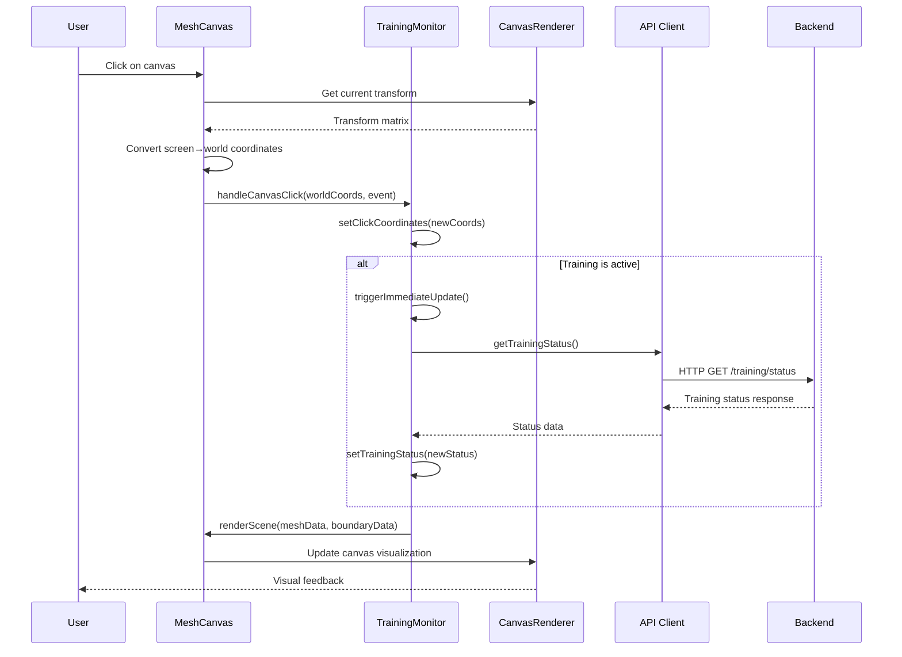

# State Management and Data Flow

## Overview

This document describes the current state management patterns in the RL Mesh Generation frontend, identifies cross-cutting state that could benefit from centralization, and documents key event flows, particularly for the TrainingMonitor component.

## Current State Architecture

### Component Local State

The majority of state in the application is currently managed at the component level using React's `useState` hook. This includes:

#### Individual Component State Patterns

**TrainingMonitor Component:**
```javascript
const [selectedMesh, setSelectedMesh] = useState('');
const [meshData, setMeshData] = useState(null);
const [boundaryData, setBoundaryData] = useState(null);
const [refPointInfo, setRefPointInfo] = useState(null);
const [clickCoordinates, setClickCoordinates] = useState(null);
const [isLoading, setIsLoading] = useState(false);
```

**Generator Component:**
```javascript
const [components, setComponents] = useState(null);
const [selectedMesh, setSelectedMesh] = useState('');
const [meshInfo, setMeshInfo] = useState(null);
const [selectedPredictor, setSelectedPredictor] = useState('');
const [selectedRefSelector, setSelectedRefSelector] = useState('');
const [selectedQualityMethod, setSelectedQualityMethod] = useState('');
const [predictorConfig, setPredictorConfig] = useState({ n: 2, g: 3, beta: 6, modelPath: '' });
const [sessionId, setSessionId] = useState(null);
const [currentStep, setCurrentStep] = useState(0);
const [isLoading, setIsLoading] = useState(false);
const [error, setError] = useState(null);
const [log, setLog] = useState([]);
```

**Action Component:**
```javascript
const [meshList, setMeshList] = useState([]);
const [selectedMesh, setSelectedMesh] = useState('');
const [meshInfo, setMeshInfo] = useState(null);
const [referencePoint, setReferencePoint] = useState(null);
const [selectedAction, setSelectedAction] = useState(null);
const [clickCoordinates, setClickCoordinates] = useState(null);
const [executionResult, setExecutionResult] = useState(null);
const [isLoading, setIsLoading] = useState(false);
const [error, setError] = useState(null);
const [log, setLog] = useState([]);
```

### Context-Based State

Currently, there are two main contexts in the application:

#### 1. ApiProvider Context
- **Purpose**: Centralized API client with error handling and retry logic
- **Scope**: Application-wide
- **State managed**: 
  - Singleton API client instance
  - Enhanced methods with error handling and retry
  - Polling utilities

#### 2. App-Level Theme State
Located in `App.jsx`:
```javascript
const [isDark, setIsDark] = useState(true);
```

Note: There's also theme state duplicated in `NavHeader.jsx`:
```javascript
const [isDark, setIsDark] = useState(true);
```

### Custom Hooks

#### useMeshGenerator Hook
The `useMeshGenerator` custom hook provides a comprehensive state machine for mesh generation:

```javascript
const [state, setState] = useState({
  // Configuration state
  selectedMesh: '',
  meshInfo: null,
  selectedPredictor: '',
  selectedRefSelector: '',
  selectedQualityMethod: '',
  predictorConfig: { n: 2, g: 3, beta: 6, modelPath: '' },
  refSelectorConfig: { n: 2 },
  
  // Session state
  sessionId: null,
  currentStep: 0,
  sessionData: null,
  actionInfo: null,
  referencePointInfo: null,
  elementQuality: null,
  
  // UI state
  isLoading: false,
  error: null,
  log: []
});
```

## Cross-Cutting State Analysis

### Current Cross-Cutting State

#### 1. Theme/Dark Mode State
- **Current status**: Duplicated across components
- **Problem**: Theme state exists independently in `App.jsx` and `NavHeader.jsx`, leading to inconsistency
- **Impact**: Theme changes in NavHeader don't affect the rest of the app

#### 2. Training Status
- **Current status**: Component-local in TrainingMonitor
- **Problem**: Training status should be accessible across components
- **Use cases**: 
  - Status indicator in navigation
  - Preventing conflicting operations in other components
  - Global training progress display

#### 3. Loading States
- **Current status**: Duplicated across all major components
- **Problem**: Multiple loading states can conflict and provide poor UX
- **Pattern**: Every component has `const [isLoading, setIsLoading] = useState(false);`

#### 4. Error Handling
- **Current status**: Local error state in each component
- **Problem**: Errors are handled inconsistently, no global error display
- **Pattern**: Each component has `const [error, setError] = useState(null);`

#### 5. Mesh Selection State
- **Current status**: Duplicated across TrainingMonitor, Generator, and Action components
- **Problem**: Changing mesh in one component doesn't update others
- **Impact**: User has to re-select meshes when switching between components

### Candidates for Centralization

#### High Priority
1. **Theme State**: Single source of truth for dark/light mode
2. **Training Status**: Global training state accessible to all components
3. **Selected Mesh**: Shared mesh selection across mesh-related components
4. **Global Loading State**: Application-wide loading indicator

#### Medium Priority  
1. **Error State**: Centralized error handling and display
2. **User Preferences**: Settings like auto-update intervals, polling frequencies
3. **Canvas State**: Shared canvas view state (zoom, pan, selection)

#### Low Priority
1. **Navigation State**: Breadcrumb state and current page context
2. **Log State**: Centralized logging across components

### Recommended State Structure

```javascript
// Global Application Context
const AppContext = {
  // Theme state
  theme: {
    isDark: boolean,
    toggleTheme: () => void
  },
  
  // Training state
  training: {
    isTraining: boolean,
    status: string,
    episode: number,
    totalEpisodes: number,
    currentReward: number,
    bestReward: number,
    elapsedTime: number
  },
  
  // Mesh state
  mesh: {
    selectedMesh: string,
    meshInfo: object | null,
    boundaryData: array | null,
    availableMeshes: array
  },
  
  // UI state
  ui: {
    isLoading: boolean,
    globalError: string | null,
    autoUpdate: boolean,
    updateInterval: number
  }
};
```

## Event Flows - TrainingMonitor

### Canvas Click → Transform → Render → API Calls Flow

#### 1. Canvas Click Event
```
User clicks on canvas → MeshCanvas component
├── canvasRef.current (HTMLCanvasElement)
├── click event → handleCanvasClick function
├── event.clientX, event.clientY (screen coordinates)
└── getBoundingClientRect() → relative canvas position
```

#### 2. Coordinate Transformation
```
Screen coordinates → World coordinates
├── renderer.getCurrentTransform() → current canvas transform matrix
├── screenX = event.clientX - rect.left
├── screenY = event.clientY - rect.top
└── renderer.screenToWorld(screenX, screenY, transform) → [worldX, worldY]
```

#### 3. State Update Flow
```
World coordinates → TrainingMonitor state update
├── handleCanvasClick callback executed
├── setClickCoordinates({
│   world: [worldX, worldY],
│   screen: [event.clientX, event.clientY],
│   timestamp: Date.now()
│ })
└── console.log('Canvas clicked at world coordinates:', worldCoords)
```

#### 4. Conditional API Calls
```
State update → Conditional training interaction
├── if (trainingStatus.is_training) {
│   └── triggerImmediateUpdate() → API call to getTrainingStatus()
├── Canvas interaction may trigger action execution
│   └── api.executeAction(actionData) when training is active
└── Polling continues → usePolling hook → periodic API updates
```

#### 5. Rendering Pipeline Update
```
API response → Canvas re-render
├── API response with new data
├── Update component state (meshData, boundaryData, etc.)
├── canvasRef.current.renderScene(meshData, boundaryData, refPointInfo)
└── Canvas element DOM update → visual feedback to user
```

### Detailed Event Flow Sequence



### State Dependencies in Event Flow

#### Input Dependencies
- `trainingStatus.is_training` - determines if immediate API calls are made
- `canvasRef.current` - required for coordinate transformation
- `renderer.getCurrentTransform()` - needed for screen-to-world conversion

#### Output State Changes
- `clickCoordinates` - always updated with new coordinates
- `trainingStatus` - conditionally updated if training is active
- Canvas visualization - updated through imperative canvas methods

#### Side Effects
- Console logging for debugging
- Immediate API polling when training is active
- Canvas re-rendering with new highlight/selection state

### Performance Considerations

#### Optimization Strategies Used
1. **Debounced Updates**: Immediate update timer (500ms) prevents excessive API calls
2. **Conditional API Calls**: Only make training status calls when actually training
3. **useCallback**: Memoized event handlers prevent unnecessary re-renders
4. **Imperative Canvas**: Direct canvas manipulation avoids React render cycles

#### Potential Improvements
1. **Throttled Click Handling**: Limit click event processing frequency
2. **Coordinate Caching**: Cache transform calculations for repeated operations
3. **State Batching**: Batch multiple state updates from single user interaction
4. **Canvas Intersection**: Only process clicks within mesh boundaries

## Recommendations

### Immediate Actions
1. **Centralize Theme State**: Move theme state to a proper context
2. **Fix Theme Inconsistency**: Ensure theme changes affect entire application
3. **Create Training Context**: Move training status to shared context

### Short-term Improvements
1. **Mesh Selection Context**: Share selected mesh across components
2. **Global Loading State**: Implement application-wide loading indicators
3. **Error Boundary**: Add centralized error handling and display

### Long-term Architecture
1. **State Management Library**: Consider Zustand or Redux Toolkit for complex state
2. **Canvas State Management**: Centralize canvas view state and interactions
3. **Real-time Updates**: WebSocket integration for live training updates
4. **State Persistence**: Save user preferences and session state
