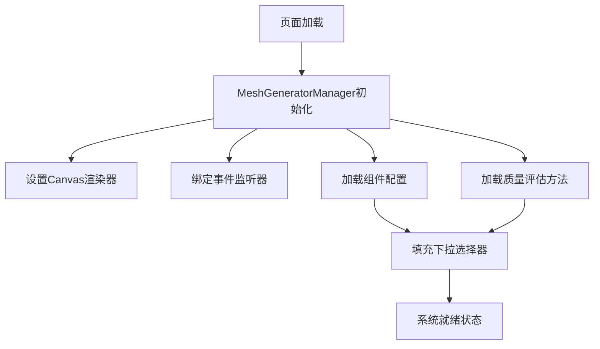
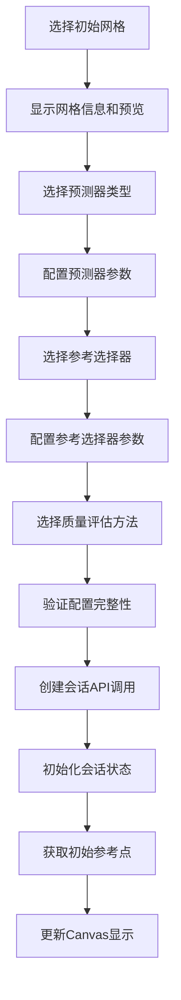
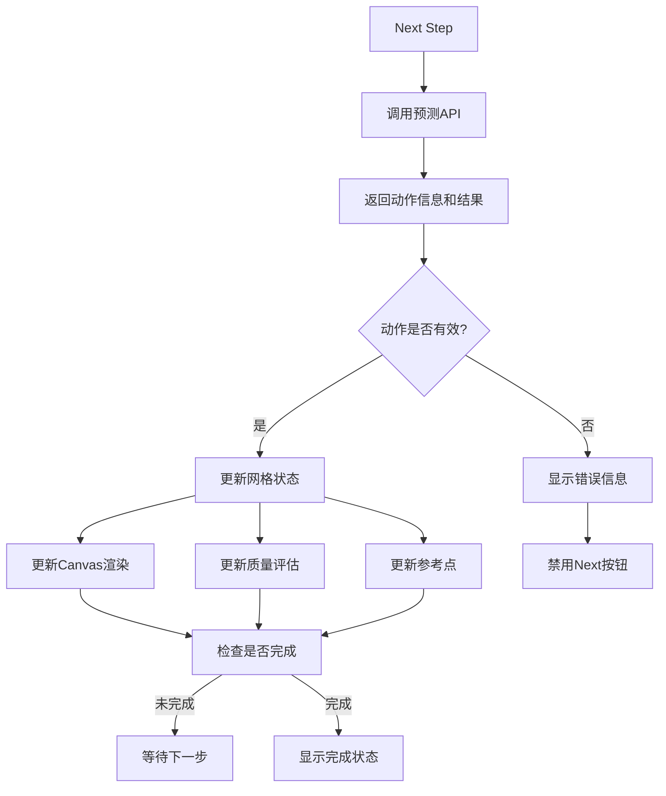
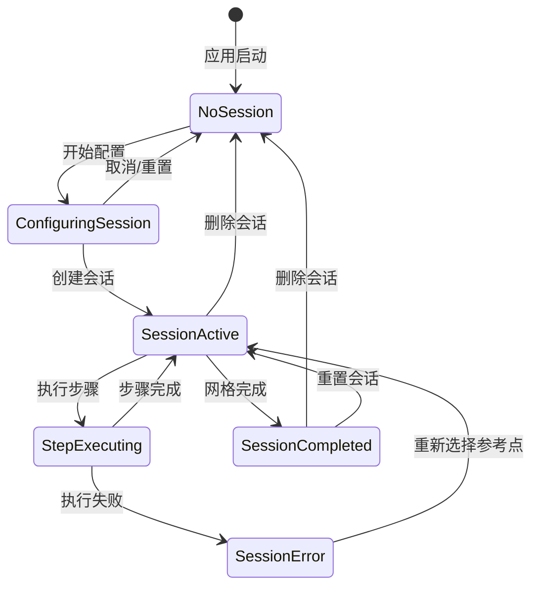
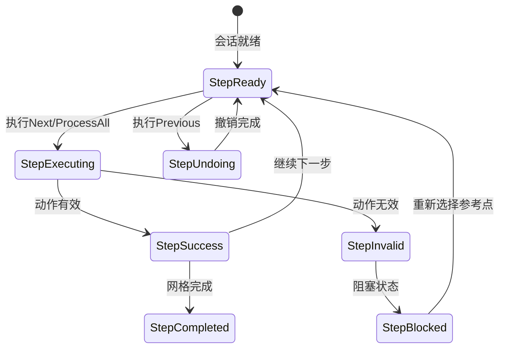
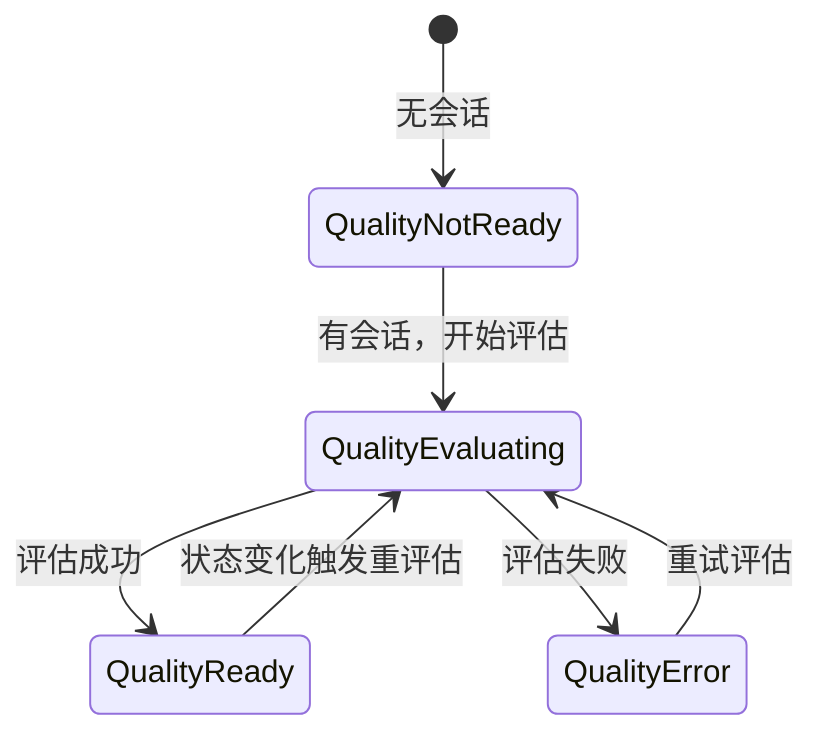
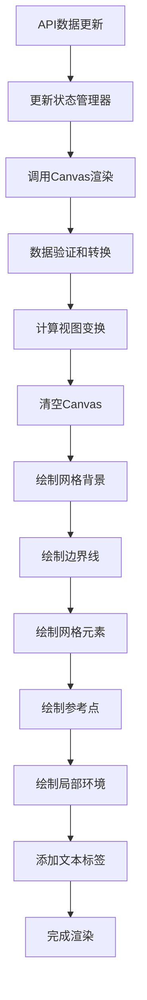

# Mesh Generator Legacy 前端功能解析文档

> **文档版本**: 1.0  
> **创建时间**: 2024年12月  
> **目标**: 为前端迁移提供全面的功能参考与验收清单  

## 概述

mesh-generator.html 是一个基于原生HTML/JavaScript的网格生成工具前端界面，集成了强化学习预测功能。本文档全面分析其架构、功能流程和技术细节，为Vue.js迁移提供详细参考。

---

## 1. 主要业务流程

### 1.1 应用初始化流程



**关键步骤**:
1. **Canvas初始化**: 设置响应式Canvas渲染器，支持高DPI显示
2. **API组件加载**: 从预测API获取可用的网格、预测器、参考选择器
3. **质量方法加载**: 获取可用的网格质量评估方法
4. **UI状态初始化**: 设置初始的空状态界面

### 1.2 会话创建与配置流程



**配置验证规则**:
- 必须选择网格文件
- 必须选择预测器类型
- 如果选择RL预测器，必须选择训练模型
- 必须选择参考选择器
- 必须选择质量评估方法

### 1.3 网格生成执行流程



**执行模式**:
- **单步执行**: 逐步执行每个预测动作
- **批量处理**: Process All 模式，一次性完成所有步骤
- **撤销功能**: Previous Step 支持逐步回退
- **重置功能**: Reset 恢复到初始边界状态

---

## 2. DOM 结构与 UI 区域划分

### 2.1 整体布局结构

```html
<body class="min-h-screen">
  <!-- 导航头部 -->
  <div class="nav-header">
    <!-- 返回按钮和标题 -->
  </div>
  
  <!-- 主容器 -->
  <div class="mesh-generator-main-container">
    <!-- 左侧配置面板 -->
    <div class="mesh-generator-left-panel">
    <!-- 中央可视化区域 -->
    <div class="mesh-generator-main-content-container">
    <!-- 右侧数据面板 -->
    <div class="mesh-generator-data-panel">
  </div>
  
  <!-- 全局loading遮罩 -->
  <div id="loading-overlay">
</body>
```

### 2.2 左侧配置面板 (350px 固定宽度)

**功能区域**:
- **会话设置区域**: 网格选择、预测器配置、参考选择器设置
- **质量方法选择**: 网格质量评估方法选择
- **会话创建按钮**: 创建新的预测会话

**关键组件**:
- `#mesh-select`: 网格文件选择器
- `#mesh-info`: 网格信息显示（顶点数、文件大小）
- `#predictor-select`: 预测器类型选择
- `#predictor-config`: 预测器参数配置（RL模型路径、N、G、Beta）
- `#ref-selector-select`: 参考选择器类型选择
- `#ref-selector-config`: 参考选择器参数配置
- `#reselect-ref-point-btn`: 重新选择参考点按钮
- `#quality-method-select`: 质量评估方法选择
- `#create-session-btn`: 创建会话按钮

### 2.3 中央可视化区域 (弹性布局)

**Canvas区域**:
```html
<div class="mesh-generator-visualization-area">
  <div class="canvas-wrapper">
    <canvas id="mesh-generator-canvas"></canvas>
    <!-- 空状态覆盖层 -->
    <div id="empty-state-overlay" class="empty-state">
  </div>
  
  <!-- 会话控制区域 -->
  <div id="session-controls" class="canvas-controls-footer">
    <!-- 操作按钮组 -->
  </div>
</div>
```

**控制按钮**:
- `#prev-step-btn`: 上一步（撤销）
- `#next-step-btn`: 下一步执行
- `#process-all-btn`: 批量处理所有步骤
- `#reset-session-btn`: 重置会话
- `#delete-session-btn`: 删除会话

### 2.4 右侧数据面板 (320px 固定宽度)

**数据显示区域**:
- **步骤详情头部**: 当前步骤状态信息
- **最后动作信息**: 动作类型、参考顶点、状态、新坐标
- **当前参考点信息**: 顶点索引、坐标、选择器类型、内角
- **网格质量信息**: 评估方法、元素数量、平均质量、状态
- **会话状态信息**: 会话ID、当前步骤、边界大小、生成元素、完成状态
- **错误显示区域**: 错误详情和验证消息
- **操作日志**: 滚动的操作记录日志

**动态显示逻辑**:
- 各区域根据会话状态动态显示/隐藏
- 数据实时更新反映当前状态
- 错误信息与成功操作分类显示

---

## 3. 全量 API 调用列表与数据模型

### 3.1 预测 API (端口: 5000/predict)

#### 3.1.1 组件信息获取
```javascript
// 获取可用组件
GET /predict/components
Response: {
  initial_meshes: string[],
  predictors: {
    [key: string]: {
      name: string,
      description: string,
      config_schema?: object
    }
  },
  reference_selectors: {
    [key: string]: {
      name: string,
      description: string,
      config_schema?: object
    }
  },
  trained_models: {
    name: string,
    path: string,
    size: number
  }[]
}
```

#### 3.1.2 质量评估方法
```javascript
// 获取质量方法
GET /predict/quality/methods
Response: {
  methods: string[]  // ["hybrid", "aspect_ratio", "area", ...]
}
```

#### 3.1.3 会话管理
```javascript
// 创建会话
POST /predict/session/create
Request: {
  mesh_name: string,
  predictor_type: string,
  ref_selector_type: string,
  predictor_config?: {
    model_path?: string,
    n?: number,
    g?: number,
    beta?: number
  },
  ref_selector_config?: {
    n?: number
  }
}
Response: {
  session_id: string,
  initial_status: SessionStatus,
  success: boolean
}
```

```javascript
// 执行下一步
POST /predict/session/{sessionId}/next
Response: {
  step_result: {
    success: boolean,
    message?: string,
    element?: number[][],  // 生成的元素顶点
    action_info: {
      action_type: string,
      reference_vertex_idx: number,
      new_coords?: number[][],
      is_valid: boolean,
      validation_message?: string
    }
  },
  status: SessionStatus
}
```

```javascript
// 执行上一步（撤销）
POST /predict/session/{sessionId}/prev
Response: {
  undo_result: {
    success: boolean,
    message: string
  },
  status?: SessionStatus
}
```

```javascript
// 批量处理
POST /predict/session/{sessionId}/process_all
Response: {
  steps_executed: number,
  completion_reason: string,  // "mesh_completed" | "invalid_action" | "max_iterations_reached"
  step_history: StepHistory[],
  final_status: SessionStatus
}
```

#### 3.1.4 会话状态查询
```javascript
// 获取会话状态
GET /predict/session/{sessionId}/status
Response: {
  status: SessionStatus
}

// 获取参考点信息
GET /predict/session/{sessionId}/reference_point
Response: {
  success: boolean,
  reference_point: ReferencePointInfo
}

// 获取质量评估
GET /predict/session/{sessionId}/quality?method={method}
Response: {
  success: boolean,
  average_quality?: number,
  element_count: number,
  message?: string
}
```

#### 3.1.5 参考点预览和配置
```javascript
// 预览参考点
POST /predict/reference_point/preview
Request: {
  mesh_name: string,
  ref_selector_type: string,
  ref_selector_config?: object
}
Response: {
  success: boolean,
  preview: {
    reference_vertex_idx: number,
    reference_vertex_coords: number[],
    boundary_vertices: number[][],
    selector_info: object,
    boundary_context: {
      interior_angle: number
    }
  }
}

// 更新会话配置
PUT /predict/session/{sessionId}/config
Request: {
  ref_selector_type: string,
  ref_selector_config?: object
}
Response: {
  success: boolean,
  status: SessionStatus
}
```

### 3.2 训练 API (端口: 5000)

```javascript
// 获取网格信息
GET /mesh/info/{meshName}
Response: {
  vertex_count: number,
  file_size: number
}

// 获取网格边界
GET /mesh/boundary/{meshName}
Response: {
  success: boolean,
  boundary_vertices: number[][],
  vertex_count: number
}
```

### 3.3 核心数据模型

#### SessionStatus
```typescript
interface SessionStatus {
  session_id: string
  current_step: number
  boundary_size: number
  generated_elements_count: number
  is_completed: boolean
  can_undo: boolean
  mesh_data?: {
    vertices: number[][]
    elements: number[][]
  }
  boundary_vertices: number[][]
  reference_point?: ReferencePointInfo
}
```

#### ReferencePointInfo
```typescript
interface ReferencePointInfo {
  reference_vertex_idx: number
  reference_vertex_coords: number[]
  selector_info: {
    type: string
    config?: object
  }
  boundary_context: {
    interior_angle: number
    neighbor_vertices?: number[][]
  }
  session_status?: SessionStatus
}
```

#### ActionInfo
```typescript
interface ActionInfo {
  action_type: string        // "type1" | "type2"
  reference_vertex_idx: number
  new_coords?: number[][]    // 新坐标（type1动作）
  is_valid: boolean
  validation_message?: string
}
```

---

## 4. 关键状态机（Session / Step / Quality / Log）

### 4.1 Session 状态机



**状态变量**:
- `sessionId`: 会话唯一标识
- `isSessionActive`: 会话是否激活
- `currentStep`: 当前执行步骤数
- `lastInvalidAction`: 最后的无效动作信息

**状态转换条件**:
- **NoSession → ConfiguringSession**: 用户开始配置参数
- **ConfiguringSession → SessionActive**: 配置验证通过，成功创建会话
- **SessionActive → SessionCompleted**: 网格生成完成
- **SessionError**: 无效动作导致的错误状态，需要重新选择参考点

### 4.2 Step 执行状态机



**执行控制**:
- **Next按钮状态**: 会话活跃 + 未完成 + 无无效动作
- **Previous按钮状态**: 会话活跃 + 可撤销 + 步骤 > 0
- **ProcessAll按钮状态**: 会话活跃 + 未完成

### 4.3 Quality 评估状态



**触发条件**:
- 会话创建后首次评估
- 每次步骤执行后自动重评估
- 质量方法更改时重评估
- 会话重置后重评估

### 4.4 Log 系统状态

**日志类型**:
- `info`: 一般信息（蓝色）
- `success`: 成功操作（绿色）
- `warning`: 警告信息（橙色）
- `error`: 错误信息（红色）

**日志管理**:
- 自动滚动到最新日志
- 最多保留100条记录
- 支持手动清空日志
- 带时间戳的结构化日志

---

## 5. Canvas 渲染逻辑与事件流

### 5.1 Canvas 渲染器架构

```typescript
class CanvasRenderer {
  // 核心属性
  canvas: HTMLCanvasElement
  ctx: CanvasRenderingContext2D
  currentTransform: Transform | null
  lastRenderData: RenderData | null
  
  // 响应式渲染
  handleResize(): void
  resizeCanvas(): void
  
  // 渲染方法
  renderScene(meshData, boundaryVertices, refPointInfo): void
  renderBoundaryPreview(boundaryVertices, meshName, refPoint?): void
  clearCanvas(): void
}
```

### 5.2 渲染数据流



### 5.3 视觉渲染规则

#### 5.3.1 颜色系统
```css
:root {
  /* Canvas绘制颜色 */
  --canvas-grid-color: rgba(255, 255, 255, 0.08);
  --canvas-mesh-edge-color: #6366F1;
  --canvas-mesh-vertex-color: #3B82F6;
  --canvas-boundary-color: #EF4444;
  --canvas-reference-color: #10B981;
  --canvas-local-env-color: #F59E0B;
}
```

#### 5.3.2 图形元素规格
- **网格顶点**: 6px半径圆点，蓝色填充
- **边界顶点**: 4px半径，红色高亮
- **参考点**: 8px半径，绿色突出显示
- **边界线**: 3px宽度，红色连线
- **网格边**: 1.5px宽度，蓝色连线

#### 5.3.3 响应式适配
- 支持高DPI显示屏适配
- 动态计算Canvas尺寸
- 防抖的窗口resize处理
- 保持渲染数据缓存

### 5.4 交互事件处理

#### 5.4.1 点击事件
```javascript
// Canvas点击处理（防抖100ms）
handleCanvasClick(event) {
  // 屏幕坐标转世界坐标
  const worldCoords = this.canvasRenderer.screenToWorld(screenX, screenY, transform);
  // 记录点击坐标到日志
  this.logMessage(`Click coordinates: (${worldCoords[0].toFixed(3)}, ${worldCoords[1].toFixed(3)})`, 'info');
}
```

#### 5.4.2 窗口调整事件
```javascript
// 防抖处理窗口大小变化
window.addEventListener('resize', () => {
  clearTimeout(resizeTimeout);
  resizeTimeout = setTimeout(() => {
    if (window.meshGeneratorManager?.handleResize) {
      window.meshGeneratorManager.handleResize();
    }
  }, 150);
});
```

### 5.5 渲染状态管理

#### 5.5.1 渲染模式
- **空状态**: 显示等待界面和网格背景
- **预览模式**: 显示网格边界和预览参考点
- **会话模式**: 完整的网格、元素、参考点渲染

#### 5.5.2 数据缓存机制
```javascript
// 缓存最后渲染数据用于resize时重绘
this.lastRenderData = {
  meshData,
  boundaryVertices, 
  refPointInfo,
  isPreview: false
};
```

---

## 6. 关键技术细节

### 6.1 API错误处理
- **网络错误**: 自动重试机制
- **API级错误**: success字段检查
- **数据验证**: 坐标和数据完整性检查
- **用户友好**: 错误信息本地化和分类展示

### 6.2 性能优化
- **防抖和节流**: 关键事件的性能优化
- **Canvas缓存**: 避免不必要的重绘
- **日志限制**: 最多100条记录防止内存泄漏
- **API请求优化**: 避免重复请求

### 6.3 响应式设计
- **弹性布局**: flex布局适配不同屏幕
- **固定侧边栏**: 保证核心功能区域稳定
- **高DPI支持**: devicePixelRatio适配
- **深色主题**: 统一的颜色系统

---

## 7. 迁移验收清单

### 7.1 功能完整性检查
- [ ] 网格文件选择和预览
- [ ] 预测器配置（包括RL模型选择）
- [ ] 参考选择器配置和预览
- [ ] 质量评估方法选择
- [ ] 会话创建和配置验证
- [ ] 单步执行和批量处理
- [ ] 撤销和重置功能
- [ ] 实时质量评估更新
- [ ] 参考点重选择功能
- [ ] 错误处理和用户提示

### 7.2 UI/UX一致性检查
- [ ] 三栏布局（350px + 弹性 + 320px）
- [ ] 深色主题和颜色系统
- [ ] Canvas响应式渲染
- [ ] 按钮状态管理
- [ ] 加载状态和进度显示
- [ ] 错误信息展示
- [ ] 操作日志记录

### 7.3 数据流一致性检查
- [ ] 所有API端点调用
- [ ] 数据模型结构匹配
- [ ] 状态管理逻辑
- [ ] 错误处理机制
- [ ] 实时数据更新

### 7.4 性能和体验检查
- [ ] Canvas渲染性能
- [ ] 响应式布局适配
- [ ] 事件处理防抖
- [ ] 内存泄漏防护
- [ ] 用户操作流畅性

---

## 8. 技术架构总结

**mesh-generator.html** 是一个功能完整的单页面应用，采用：

- **模块化JavaScript**: ES6模块化架构
- **Canvas 2D渲染**: 自定义渲染引擎
- **RESTful API集成**: 双端点API调用
- **响应式布局**: 弹性布局配合固定面板
- **状态管理**: 基于类的状态管理模式
- **事件驱动**: 完整的事件监听和处理机制

该架构为Vue.js迁移提供了清晰的功能边界和数据流参考，可直接映射为Vue组件化架构。

---

**注**: 本文档基于当前代码版本生成，随着功能更新可能需要相应调整。建议在迁移过程中与原版本进行功能对比验证。
